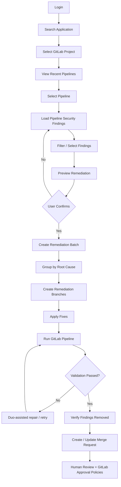
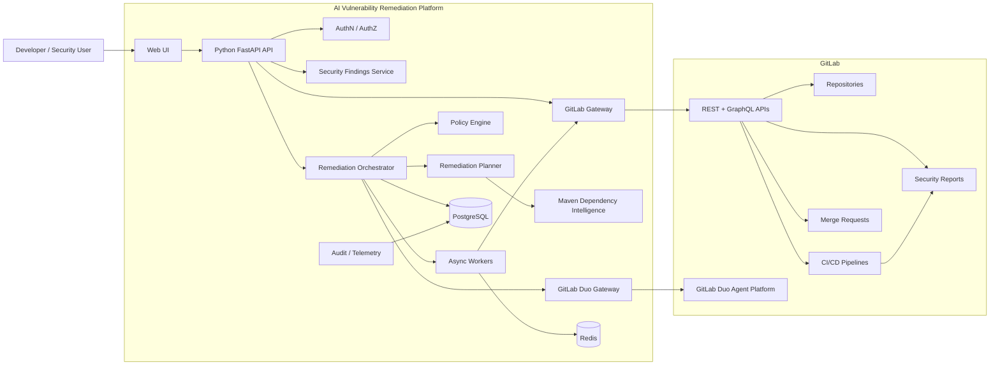
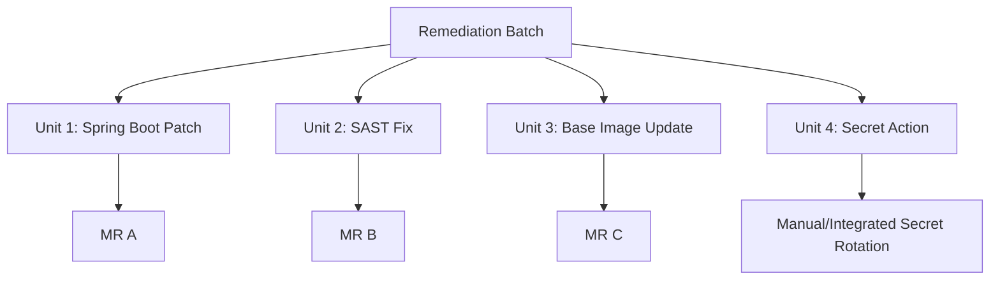
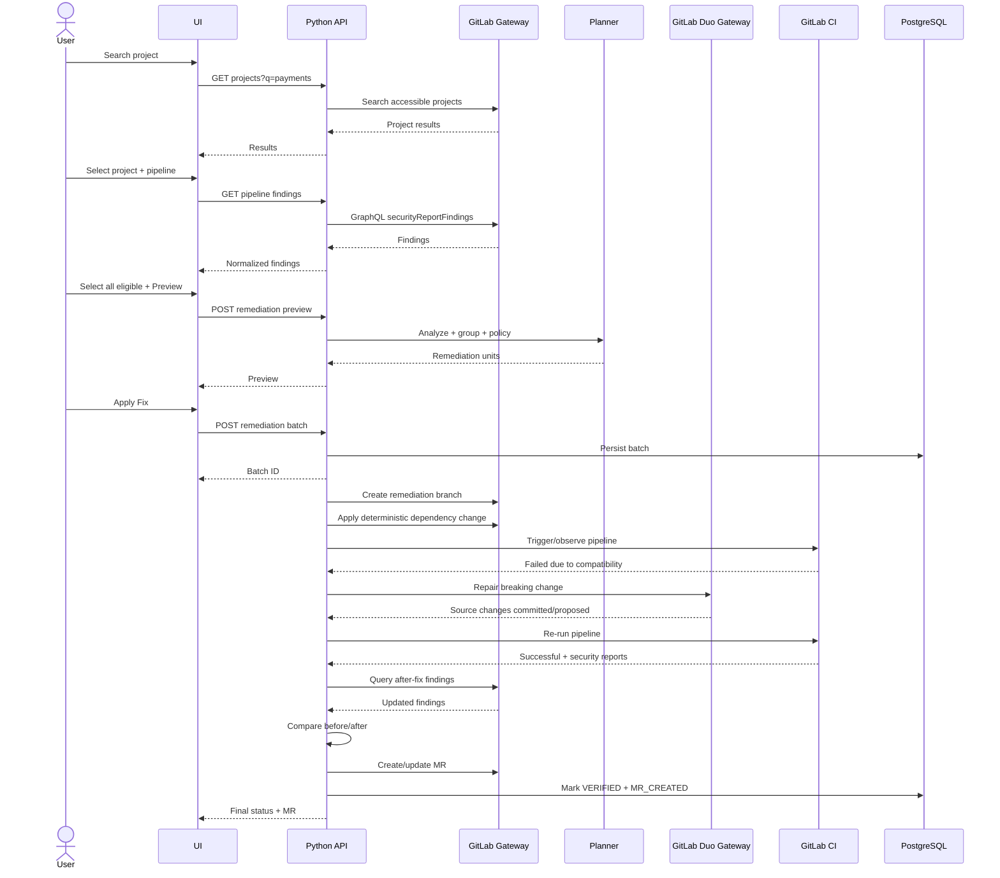
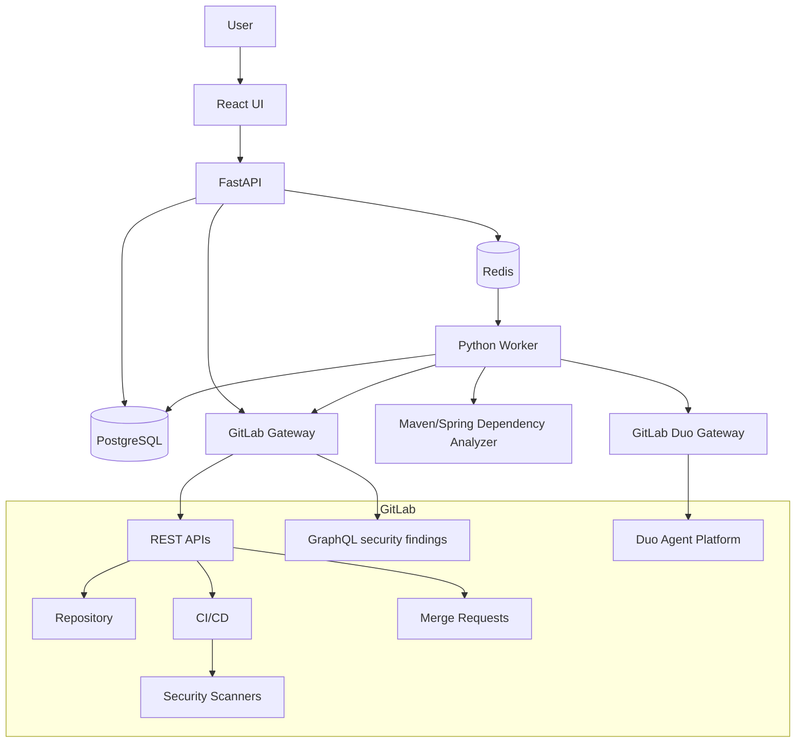

# AI Vulnerability Remediation Platform
## Production-Grade Architecture & Design for GitLab + GitLab Duo + Python

**Document status:** Architecture Draft v1  
**Primary application stack being remediated:** Java / Spring Boot / Maven  
**Remediation platform implementation:** Python  
**Source control / CI/CD / security platform:** GitLab  
**AI platform:** GitLab Duo Agent Platform  
**Last updated:** 2026-09-02

---

# 1. Executive Summary

The organization already runs GitLab security scanning in application pipelines, including:

- SAST
- Dependency Scanning
- Container Scanning
- Secret Detection

The proposed platform does **not** replace those scanners. GitLab remains the authoritative detection and validation platform.

The new application provides a centralized remediation experience where a user can:

1. Search for an application / GitLab project.
2. View recent pipelines.
3. Select a pipeline.
4. View the security findings produced by that pipeline.
5. Filter and select one, many, or all findings.
6. Request a remediation preview.
7. Review how the system plans to fix the findings.
8. Start a remediation batch.
9. Track automated fixes and validation.
10. Review the resulting GitLab merge request(s).

The platform will be implemented primarily in Python and will use GitLab Duo selectively for reasoning-intensive remediation. Deterministic logic should remain responsible for policy enforcement, dependency analysis, validation, permissions, and final safety decisions.

The central production principle is:

> **GitLab detects. Python orchestrates. GitLab Duo reasons and repairs. GitLab CI validates. Humans approve production changes.**

The system must **never push directly to the protected/default branch and must never deploy directly to production**.

---

# 2. Problem Statement

Security scans already identify vulnerabilities, but remediation is expensive because engineers must repeatedly:

- find the relevant pipeline,
- inspect many findings,
- determine whether findings share a common root cause,
- identify the correct Maven/Spring dependency that introduced a vulnerable transitive JAR,
- determine whether a dependency is managed by Spring Boot, another BOM, a parent POM, or an internal library,
- identify a compatible non-vulnerable version,
- update the project,
- resolve compilation or behavioral breaking changes,
- execute tests,
- rerun security scans,
- prove that the intended vulnerabilities were removed,
- create and manage merge requests.

This becomes especially difficult when many findings are caused by a small number of dependency roots.

For example, ten CVEs may all originate from the same vulnerable transitive dependency. Fixing each CVE independently would create unnecessary changes and merge requests. A production remediation system should recognize the shared dependency root and create one safe fix when possible.

---

# 3. Goals

## 3.1 Primary goals

The system shall:

- provide application/project search,
- display project pipelines,
- display pipeline security findings,
- support filtering by scanner, severity, state, fix availability, dependency, and identifier,
- support selecting individual findings or selecting all eligible findings,
- determine which findings are automatically fixable,
- group related vulnerabilities into minimal remediation units,
- generate a remediation plan before making changes,
- apply changes only on isolated remediation branches,
- use GitLab Duo for appropriate vulnerability classes and complex repairs,
- run the project pipeline after remediation,
- re-evaluate security results after the fix,
- create merge requests instead of directly updating protected branches,
- provide complete audit history,
- support enterprise authorization and least privilege,
- operate safely across multiple GitLab projects.

## 3.2 Success definition

A remediation is considered successful only when:

1. The proposed code/dependency change is committed to an isolated branch.
2. Required build and test jobs pass.
3. Required security scans complete successfully.
4. The selected vulnerability or root-cause vulnerability group is no longer detected.
5. The remediation does not introduce prohibited new vulnerabilities.
6. A merge request is available for normal review/approval.

---

# 4. Non-Goals

The first production version should **not**:

- replace GitLab security scanners,
- maintain a separate CVE database as the source of truth,
- automatically merge into the default branch,
- automatically deploy to production,
- automatically dismiss vulnerabilities as false positives without policy-controlled review,
- treat secret detection like a normal source-code vulnerability,
- blindly update every dependency to its newest available version,
- automatically perform major framework upgrades unless explicitly approved by policy,
- allow an LLM to decide whether security gates can be bypassed,
- execute arbitrary repository code inside the remediation API server process.

---

# 5. Key Architecture Decisions

## ADR-001 — GitLab remains the system of record for vulnerabilities

Pipeline findings and default-branch vulnerabilities should be read from GitLab instead of independently reproducing scanner logic.

GitLab distinguishes **findings** from **vulnerabilities**:

- findings are associated with pipeline/branch security scans,
- vulnerabilities are persistent records associated with the default branch.

The UI in this platform is pipeline-centric, so the primary query should use the pipeline security findings model.

## ADR-002 — Use GitLab GraphQL as the primary security findings interface

GitLab documents the older Vulnerability Findings REST API and Project Vulnerabilities REST API as unstable/deprecating and recommends GraphQL.

The platform should therefore use:

- REST for project/pipeline lifecycle operations where REST is stable and natural,
- GraphQL for pipeline security findings and vulnerability enrichment.

Primary GraphQL concept:

`Pipeline.securityReportFindings`

## ADR-003 — Python owns orchestration; GitLab Duo is not the control plane

GitLab Duo should be treated as a remediation capability behind an internal abstraction.

The Python platform remains responsible for:

- authorization,
- policy,
- eligibility,
- grouping,
- state transitions,
- retries,
- timeouts,
- audit,
- Git operations,
- validation,
- deciding whether remediation succeeded.

The LLM/agent must never be the authority for production safety decisions.

## ADR-004 — “Select All” creates a remediation batch, not an uncontrolled mass edit

When a user selects all findings, the platform should:

1. create a batch,
2. normalize findings,
3. classify fixability,
4. group findings by root cause,
5. generate a preview,
6. execute only eligible remediation units.

Findings that cannot be safely automated remain visible as `REQUIRES_MANUAL_ACTION` or `REQUIRES_SECURITY_ACTION`.

## ADR-005 — All changes go through merge requests

No direct writes to the default/protected branch.

The remediation service creates:

- a remediation branch,
- one or more commits,
- a merge request,
- a validation pipeline.

Normal GitLab approval/security policies remain authoritative.

## ADR-006 — Validation occurs in GitLab runners, not the web application container

The remediation API must not clone an arbitrary repository and execute its Maven lifecycle directly inside the API pod/server.

Potentially untrusted builds should execute inside:

- GitLab CI runners, or
- tightly isolated ephemeral Kubernetes jobs if an offline analysis stage requires it.

GitLab CI is the recommended source of truth for final validation because it reproduces the application’s actual pipeline environment and security policies.

---

# 6. User Experience

## 6.1 Primary workflow



## 6.2 Search page

The user should be able to search using:

- project/application name,
- namespace,
- GitLab project path,
- project ID,
- optionally internal application ID if the enterprise maintains an application registry.

Suggested result columns:

| Field | Purpose |
|---|---|
| Application | Friendly name |
| GitLab Path | Namespace/project |
| Default Branch | main/master/etc. |
| Last Pipeline | Most recent relevant pipeline |
| Pipeline Status | success/failed/running |
| Security Findings | Count if cached |
| Last Activity | Project freshness |

## 6.3 Pipeline page

Suggested columns:

| Field | Purpose |
|---|---|
| Pipeline ID | GitLab pipeline ID |
| Ref | Branch/tag |
| SHA | Exact commit scanned |
| Status | success/failed/etc. |
| Created | Pipeline creation time |
| Security Reports | Scanner types available |
| Action | View findings |

The remediation platform must bind findings to the exact pipeline SHA. A fix must not accidentally be generated from one commit and applied to another without re-analysis.

## 6.4 Vulnerability/findings page

Suggested table:

| Select | Severity | Scanner | Finding | Identifier | Location/Package | Fixability | Root Cause Group | Status |
|---|---|---|---|---|---|---|---|---|

Filters:

- scanner type,
- severity,
- status/state,
- fixable / non-fixable,
- CVE/CWE,
- package,
- direct/transitive dependency,
- KEV,
- EPSS,
- reachability if available,
- remediation status.

Actions:

- Select All Eligible
- Select All Visible
- Preview Fix
- Apply Fix

`Select All Visible` must not mean that every selected finding is automatically editable. The preview screen must clearly separate eligible and non-eligible findings.

---

# 7. High-Level Architecture



---

# 8. Recommended Technology Stack

## 8.1 Backend

Recommended:

- Python 3.13+
- FastAPI
- Pydantic
- SQLAlchemy 2.x
- Alembic
- PostgreSQL
- Redis
- Celery, Dramatiq, or equivalent production task queue
- HTTPX for GitLab API calls
- OpenTelemetry
- structured JSON logging

FastAPI should handle user-facing API requests. Long-running remediation work must execute asynchronously through workers.

## 8.2 Frontend

For a production enterprise portal, preferred:

- React + TypeScript

Alternative for a smaller internal product:

- FastAPI + server-rendered templates + HTMX

Avoid using Streamlit as the main production remediation portal because this application requires fine-grained security controls, stateful workflows, background jobs, detailed auditability, and enterprise UI behavior.

## 8.3 Deployment

Recommended:

- containerized services,
- Kubernetes/OpenShift if already available,
- separate API and worker deployments,
- internal ingress,
- enterprise SSO,
- secrets retrieved from the organization’s secrets manager,
- network policies restricting access to GitLab and required internal services.

---

# 9. Logical Components

## 9.1 Web UI

Responsibilities:

- project search,
- pipeline selection,
- vulnerability table,
- remediation preview,
- batch execution status,
- MR links,
- audit/event display.

The UI must never contain remediation business rules that are not enforced server-side.

## 9.2 Authentication and Authorization Service

Responsibilities:

- authenticate the user through enterprise SSO,
- determine GitLab identity,
- validate user access to the requested project,
- enforce remediation permissions.

Recommended application roles:

- `VIEWER`
- `DEVELOPER`
- `REMEDIATOR`
- `SECURITY_APPROVER`
- `PLATFORM_ADMIN`

Project permission must still be validated against GitLab. Local application roles should not grant a user access to a GitLab project the user cannot access.

## 9.3 GitLab Gateway

All GitLab integration should be hidden behind a dedicated adapter/service.

Responsibilities:

- project search,
- pipeline retrieval,
- GraphQL security finding queries,
- repository metadata,
- branch creation,
- commit operations,
- merge request creation,
- pipeline status retrieval,
- MR pipeline retrieval,
- optional job/artifact retrieval.

The rest of the application should not directly embed GitLab URLs/endpoints.

This makes GitLab version changes easier to contain.

## 9.4 Security Findings Service

Responsibilities:

- query pipeline security findings,
- normalize scanner-specific structures,
- enrich with project/pipeline metadata,
- generate stable internal fingerprints,
- classify findings,
- cache immutable pipeline snapshots.

Do not persist GitLab findings as a competing authoritative vulnerability database. Persist a **snapshot/reference** needed for workflow and audit.

## 9.5 Policy Engine

The Policy Engine determines what the platform is allowed to do.

Examples:

- which scanners are eligible for automatic remediation,
- which severities may be processed,
- whether major dependency upgrades are allowed,
- maximum number of files changed,
- maximum diff size,
- whether a secret finding can ever be marked complete automatically,
- whether a container base image can cross a major distribution version,
- required validation jobs,
- required security approvals,
- retry limits,
- allowed branch prefixes.

The policy engine must be deterministic and version controlled.

## 9.6 Remediation Planner

The planner transforms selected findings into remediation units.

Input:

- selected findings,
- project metadata,
- exact source SHA,
- repository dependency information,
- policy.

Output:

- eligible findings,
- unsupported findings,
- manual-action findings,
- root-cause groups,
- proposed strategies,
- expected files to change,
- risk classification,
- execution order.

Planning should happen **before** repository mutation.

## 9.7 Maven Dependency Intelligence Service

This component is especially important for Spring Boot applications.

Responsibilities:

- identify project/module POMs,
- understand parent POM hierarchy,
- understand `dependencyManagement`,
- understand imported BOMs,
- understand Spring Boot dependency management,
- resolve Maven properties,
- identify direct vs transitive dependency paths,
- identify the nearest controlling dependency/version,
- determine which vulnerable findings share the same root cause,
- propose minimal compatible dependency changes.

Inputs may include deterministic outputs such as:

- Maven effective POM,
- dependency tree,
- dependency management metadata,
- GitLab SBOM/dependency scan metadata where available.

### Spring Boot remediation priority

For Spring Boot applications, candidate strategies should generally be evaluated in this order:

1. Safe Spring Boot patch upgrade that brings a fixed managed dependency.
2. Safe platform/BOM patch or minor upgrade.
3. Safe direct dependency upgrade.
4. Upgrade of the direct ancestor that brings a vulnerable transitive dependency.
5. Narrow `dependencyManagement` override when organizational policy allows it.
6. Exclusion/replacement only when justified and validated.

A transitive JAR should not automatically be added as an explicit direct dependency just because its version is vulnerable.

## 9.8 GitLab Duo Gateway

GitLab Duo integrations must be encapsulated behind a stable internal interface because GitLab Agent Platform capabilities and invocation mechanisms evolve by GitLab version.

Suggested internal capabilities:

- `resolve_sast_finding`
- `repair_dependency_breaking_change`
- `analyze_complex_dependency_upgrade`
- `repair_build_failure`
- `explain_remediation`

The application should not expose a generic “run arbitrary agent prompt” action to end users.

## 9.9 Remediation Orchestrator

The orchestrator is the workflow brain.

Responsibilities:

- create remediation batch,
- invoke planner,
- enforce policy,
- schedule remediation units,
- serialize conflicting work,
- create branches,
- invoke deterministic or Duo remediation,
- trigger/observe validation pipeline,
- compare before/after findings,
- create/update merge request,
- persist state transitions,
- handle retries and failures.

## 9.10 Async Worker Layer

Required because remediation can take many minutes.

Long-running operations:

- repository analysis,
- Duo execution,
- waiting for pipeline completion,
- security result comparison,
- retries,
- MR generation.

HTTP requests should enqueue work and return a remediation batch identifier instead of remaining open.

## 9.11 Audit and Observability Service

Every material action should be attributable to:

- initiating user,
- service identity,
- project,
- pipeline,
- source SHA,
- selected findings,
- remediation plan,
- agent invocation,
- prompt/instruction version identifier,
- file changes,
- pipeline validation,
- final result,
- MR.

Sensitive model inputs should be handled according to enterprise data retention rules. Do not log raw secrets discovered by Secret Detection.

---

# 10. GitLab Integration Design

## 10.1 Project search

Use stable GitLab project/search APIs.

Search should be restricted to projects the authenticated identity is allowed to access.

## 10.2 Pipeline retrieval

Use the project pipelines API to retrieve pipeline history.

The system should default to:

- latest default-branch pipelines,
- successful or completed pipelines,
- with user controls for branch/ref and status.

## 10.3 Pipeline security findings

Use GitLab GraphQL `Pipeline.securityReportFindings` as the primary pipeline security finding interface.

Store:

- GitLab project ID,
- pipeline ID,
- SHA,
- finding UUID,
- scanner,
- severity,
- state,
- identifiers,
- location,
- description hash,
- fix availability metadata when available.

## 10.4 GraphQL vs REST strategy

| Domain | Preferred Interface |
|---|---|
| Project search | REST |
| Pipeline list/status | REST |
| Pipeline security findings | GraphQL |
| CVE enrichment | GraphQL |
| Branch/commit | REST |
| Merge request | REST |
| MR pipelines | REST |
| Job artifacts | REST when required |
| Duo flow execution | Wrapped behind Duo Gateway |

## 10.5 GitLab compatibility layer

At startup or configuration time the platform should record:

- GitLab base URL,
- GitLab version,
- edition/tier,
- Duo availability,
- Duo Agent Platform availability,
- supported foundational flows,
- supported API features.

Capabilities should be feature-detected instead of assumed globally.

---

# 11. GitLab Duo Strategy

GitLab Duo should be used where it adds reasoning value rather than for every dependency edit.

## 11.1 Native capabilities to leverage

Depending on the organization’s GitLab version/tier/configuration, relevant capabilities include:

- GitLab Duo Agent Platform,
- custom agents,
- custom flows,
- SAST Vulnerability Resolution,
- SAST False Positive Detection,
- Security Analyst capabilities,
- dependency auto-remediation,
- agentic breaking-change resolution for dependency bumps.

## 11.2 Recommended three-layer Duo model

### Layer 1 — Native GitLab foundational flows

Use native GitLab functionality when GitLab already owns the workflow well.

Example:

- SAST vulnerability resolution.

### Layer 2 — Deterministic Python dependency remediation

Use deterministic Maven logic for straightforward dependency upgrades.

Examples:

- property version bump,
- Spring Boot patch bump,
- BOM patch bump,
- direct dependency patch/minor upgrade.

Duo is unnecessary when a change can be proven mechanically.

### Layer 3 — Duo escalation

Invoke Duo when the deterministic change fails or requires contextual source-code repair.

Examples:

- dependency version bump breaks Java compilation,
- Spring API changed,
- method signature changed,
- package was renamed,
- configuration property was removed,
- deprecated API requires source changes,
- SAST finding requires semantic code modification.

## 11.3 Do not hard-couple to experimental flow APIs

GitLab exposes Agent Platform flow APIs, but some trigger operations are documented as experimental in current releases.

Production design requirement:

> The Python application must call an internal `DuoGateway`, never a GitLab experimental endpoint directly from business logic.

Possible implementations of `DuoGateway` may evolve between GitLab versions:

- foundational flow invocation,
- custom flow trigger,
- merge-request discussion trigger,
- service account/external agent trigger,
- future stable Agent Platform API.

## 11.4 Project-specific AI instructions

For repositories that use Duo, maintain reviewed repository instructions such as an `AGENTS.md` file or GitLab Duo custom rules containing:

- approved Java version,
- Spring Boot version policy,
- preferred testing commands,
- files the agent may edit,
- dependency policy,
- banned libraries,
- architecture boundaries,
- logging/security requirements,
- “never disable tests/scanners” rule.

These instructions are part of the controlled remediation configuration and should be reviewed like application code.

---

# 12. Scanner-Specific Remediation Model

Not every GitLab finding should use the same remediation path.

| Scanner | Automation Level | Primary Fix Strategy | Special Control |
|---|---:|---|---|
| Dependency Scanning | High | Maven/BOM/dependency upgrade | Dependency compatibility validation |
| SAST | High/Medium | GitLab Duo context-aware source fix | Source diff + tests + re-scan |
| Container Scanning | Medium | Base image/package update | Image compatibility and rebuild |
| Secret Detection | Low for full resolution | Remove secret from source and rotate/revoke externally | Never mark resolved solely because text was deleted |

## 12.1 Dependency Scanning

This should be the first optimized production use case.

The platform should recognize:

- direct dependencies,
- transitive dependencies,
- parent POM-controlled versions,
- imported BOMs,
- Spring Boot-managed dependencies,
- plugin dependencies separately from runtime dependencies,
- multi-module Maven builds.

## 12.2 SAST

If native GitLab Duo SAST Vulnerability Resolution is available, prefer it rather than rebuilding the same capability externally.

The remediation platform acts as the orchestrator:

- user selects findings,
- platform validates eligibility,
- platform invokes supported Duo resolution capability,
- platform tracks resulting MR/branch/pipeline,
- platform independently validates the result.

## 12.3 Container Scanning

Potential remediation categories:

- update base image tag/digest,
- update OS packages,
- update runtime image,
- rebuild application image.

Auto-remediation should be more conservative than Maven dependency updates because base-image changes can alter:

- OS libraries,
- Java runtime,
- certificates,
- shell/tools,
- user permissions,
- startup behavior.

## 12.4 Secret Detection

A detected secret has two problems:

1. the secret exists in repository/history or generated artifacts,
2. the credential may already be compromised.

Deleting the secret from source is not equivalent to remediation.

The platform should instead create a security action plan:

- identify secret type without exposing its value,
- remove/replace source reference,
- require credential rotation/revocation,
- require owner confirmation or automation from an approved secrets system,
- rerun Secret Detection,
- keep an auditable record.

Raw secret values must never be passed to GitLab Duo prompts, application logs, analytics, or general database fields.

---

# 13. Root-Cause Grouping

This is a critical differentiator of the platform.

## 13.1 Why grouping matters

Suppose a pipeline reports:

- CVE-A in `netty-handler`,
- CVE-B in `netty-codec`,
- CVE-C in `netty-common`,
- CVE-D in another Netty module.

All may be controlled by one BOM or framework version.

Creating four independent changes is inferior to identifying the owning dependency/BOM and creating one consistent fix.

## 13.2 Suggested grouping keys

For dependency findings, group using progressively stronger relationships:

1. same package + same installed version,
2. same Maven dependency-management owner,
3. same direct ancestor,
4. same BOM/platform,
5. same Spring Boot upgrade candidate,
6. same required source compatibility change.

## 13.3 Remediation Unit

A `RemediationUnit` represents the smallest independent change that can fix one or more selected findings.

Example:

```text
Unit RU-101
Project: payments-api
Source SHA: abc123
Strategy: SPRING_BOOT_PATCH_UPGRADE
Change: 3.x.a -> 3.x.b
Selected findings fixed: 12
Files expected: pom.xml
Risk: LOW
Validation: full pipeline + dependency scan
```

This model avoids one branch/MR per vulnerability.

---

# 14. Dependency Remediation Decision Model

For each dependency root cause, generate candidates instead of immediately editing the POM.

## 14.1 Candidate strategies

- Spring Boot patch upgrade
- Spring Boot minor upgrade
- parent POM upgrade
- imported BOM upgrade
- direct dependency patch upgrade
- direct dependency minor upgrade
- transitive parent upgrade
- controlled dependency-management override
- exclusion/replacement
- no safe automatic fix

## 14.2 Risk score inputs

Example inputs:

- patch/minor/major version movement,
- framework vs leaf library,
- direct vs transitive dependency,
- number of modules affected,
- number of files expected to change,
- public API changes,
- Java version compatibility,
- Spring Boot compatibility,
- prior successful remediation pattern,
- test coverage available,
- selected vulnerabilities fixed,
- new vulnerabilities introduced.

The scoring algorithm should be deterministic. Duo may provide additional explanation but should not unilaterally set the final policy risk level.

---

# 15. Remediation Batch Model

A user may select dozens of findings. The application should represent this as one batch containing multiple remediation units.



Do not put unrelated high-risk changes into one giant merge request just because the user selected all findings.

---

# 16. State Machine

## 16.1 Batch states

```text
CREATED
  -> PLANNING
  -> READY_FOR_CONFIRMATION
  -> QUEUED
  -> RUNNING
  -> PARTIALLY_SUCCEEDED | SUCCEEDED | FAILED | CANCELLED
```

## 16.2 Remediation unit states

```text
DISCOVERED
SELECTED
ANALYZING
ELIGIBLE
REQUIRES_REVIEW
REQUIRES_SECURITY_ACTION
UNSUPPORTED
QUEUED
BRANCH_CREATED
FIX_IN_PROGRESS
FIX_APPLIED
VALIDATING
DUO_REPAIR_IN_PROGRESS
VERIFIED
MR_CREATED
FAILED
CANCELLED
```

Every transition should be append-only audited.

---

# 17. Detailed Remediation Sequence



---

# 18. Validation Gates

A fix is not successful because the AI says it is fixed.

The following are recommended mandatory gates.

## Gate 1 — Repository integrity

- branch created from expected SHA,
- protected/default branch unchanged,
- no unauthorized files changed,
- diff within policy limits.

## Gate 2 — Build

- Maven dependency resolution succeeds,
- compilation succeeds,
- packaging succeeds.

## Gate 3 — Tests

- unit tests,
- integration tests,
- contract tests where configured,
- smoke tests where configured.

## Gate 4 — Security scans

Existing GitLab scans execute again:

- SAST,
- dependency scanning,
- container scanning,
- secret detection,
- any organization-required additional scans.

## Gate 5 — Before/after security comparison

For every selected finding, classify:

- `FIXED`
- `STILL_PRESENT`
- `CHANGED_IDENTIFIER`
- `UNVERIFIABLE`

Also identify:

- new critical findings,
- new high findings,
- policy-prohibited medium findings,
- scanner failures/missing reports.

A missing scanner is not a passing scan.

## Gate 6 — Merge request policy

GitLab security/approval policies remain in force.

Recommended controls:

- protected target branch,
- prevent direct push,
- prevent author self-approval where required,
- security approval for critical/high security changes,
- re-approval when new commits are added.

---

# 19. Branch and Merge Request Strategy

Recommended branch pattern:

```text
ai-remediation/<project>/<batch-id>/<unit-id>
```

or a GitLab-Duo-compatible organization-specific pattern if Duo requires one.

Suggested MR title:

```text
[AI Remediation] Fix 12 dependency vulnerabilities via Spring Boot patch upgrade
```

MR description should include:

- source pipeline,
- source SHA,
- remediation batch ID,
- selected vulnerabilities,
- grouped root cause,
- dependency change,
- why the strategy was selected,
- files changed,
- validation pipeline,
- vulnerabilities removed,
- new findings introduced,
- Duo involvement,
- known residual risk,
- required reviewers.

No AI-generated MR should bypass existing Code Owners, protected branch rules, or security policies.

---

# 20. Data Model

## 20.1 Core entities

### `gitlab_project`

- internal ID
- GitLab project ID
- full path
- default branch
- GitLab instance ID
- cached metadata
- last refreshed timestamp

### `pipeline_snapshot`

- project ID
- GitLab pipeline ID
- SHA
- ref
- status
- created time
- scanner availability
- snapshot timestamp

### `security_finding_snapshot`

- pipeline snapshot ID
- GitLab finding UUID
- scanner type
- severity
- state
- title
- primary identifier
- package/location reference
- normalized fingerprint
- fixability classification
- raw payload reference/hash where policy permits

### `remediation_batch`

- batch UUID
- initiating user
- project
- source pipeline
- source SHA
- state
- policy version
- created time
- completion time

### `remediation_unit`

- unit UUID
- batch UUID
- remediation strategy
- root cause key
- risk level
- state
- source branch
- MR reference
- selected finding count

### `remediation_item`

Maps selected security findings to remediation units.

- remediation unit ID
- finding UUID/fingerprint
- before status
- after status
- verification result

### `remediation_attempt`

- unit ID
- attempt number
- actor type (`DETERMINISTIC`, `GITLAB_DUO`)
- action type
- input fingerprint
- output fingerprint
- pipeline ID
- result
- error category
- timestamps

### `audit_event`

Append-only event record.

- timestamp
- user/service identity
- action
- project
- batch
- unit
- GitLab object references
- policy decision
- correlation ID

---

# 21. API Design

This section defines resource boundaries, not implementation code.

## 21.1 Project discovery

```text
GET /api/v1/projects?query=<text>
GET /api/v1/projects/{project_id}
```

## 21.2 Pipelines

```text
GET /api/v1/projects/{project_id}/pipelines
GET /api/v1/projects/{project_id}/pipelines/{pipeline_id}
```

## 21.3 Findings

```text
GET /api/v1/projects/{project_id}/pipelines/{pipeline_id}/findings
```

Filters:

- scanner
- severity
- state
- fixability
- identifier
- package

## 21.4 Remediation preview

```text
POST /api/v1/remediation-previews
```

Input conceptually includes:

- project,
- pipeline,
- source SHA,
- selected finding UUIDs.

Response includes:

- eligible count,
- non-eligible count,
- remediation units,
- proposed strategies,
- risk,
- expected branches/MRs,
- warnings.

## 21.5 Start remediation

```text
POST /api/v1/remediation-batches
```

## 21.6 Status

```text
GET /api/v1/remediation-batches/{batch_id}
GET /api/v1/remediation-batches/{batch_id}/units
GET /api/v1/remediation-units/{unit_id}/events
```

## 21.7 Cancel

```text
POST /api/v1/remediation-batches/{batch_id}/cancel
```

Cancellation should stop pending work but not rewrite history or delete already-created GitLab branches/MRs unless explicitly requested and permitted.

---

# 22. Authentication and GitLab Identity

A production deployment should avoid one shared personal access token for all actions.

Recommended identity model:

## User read operations

Use the user’s GitLab identity/OAuth context where practical so project visibility follows GitLab authorization.

## Remediation writes

Use a controlled GitLab service account/project automation identity with minimal required permissions.

The audit log must retain both:

- initiating human user,
- technical service identity that performed the change.

## Duo executions

Follow GitLab Agent Platform composite identity/service-account behavior where applicable.

Long-lived broad-access tokens should be avoided. Prefer scoped, short-lived, or workload/OIDC-based credentials where GitLab and enterprise infrastructure support them.

---

# 23. Security Threat Model

An AI remediation platform is a privileged security system and should be threat-modeled accordingly.

## Threat 1 — Prompt injection from repository content

A malicious source file could contain instructions intended to manipulate the agent.

Controls:

- repository content is untrusted data,
- fixed system instructions cannot be overridden by repository text,
- allowlisted tools,
- allowlisted write paths,
- deterministic policy enforcement after agent output,
- agent cannot approve/merge its own output.

## Threat 2 — Agent modifies CI/security controls

A generated fix could attempt to disable a scan or test.

Controls:

- block modifications to protected CI/security policy files by default,
- diff policy checks,
- code owners,
- security approval policies,
- explicit exception workflow.

Sensitive examples:

- `.gitlab-ci.yml`
- security policy files
- scanner configuration
- approval rules

## Threat 3 — Credential exfiltration

Controls:

- no production credentials inside agent context,
- no raw detected secrets passed to LLM,
- egress restrictions,
- secret masking,
- OIDC/short-lived credentials,
- minimal token scope.

## Threat 4 — Execution of malicious repository build logic

Controls:

- never execute repository build commands in the API pod,
- use isolated GitLab runners,
- hardened runner images,
- ephemeral workspaces,
- network restrictions.

## Threat 5 — Supply-chain poisoning during remediation

Controls:

- approved Maven repositories only,
- existing artifact repository policy,
- version allow/deny policy,
- dependency scan after fix,
- SBOM/dependency comparison,
- no arbitrary new repositories inserted by the agent.

## Threat 6 — Excessive change scope

Controls:

- maximum files changed,
- maximum diff size,
- expected-file allowlist by strategy,
- stop and require review if scope exceeds expectation.

---

# 24. Production Guardrails

Default recommended policy:

| Control | Default |
|---|---|
| Direct push to default branch | DENY |
| Automatic merge | DENY |
| Automatic production deployment | DENY |
| Patch dependency upgrades | ALLOW |
| Minor leaf dependency upgrades | ALLOW with validation |
| Major dependency upgrades | REQUIRE REVIEW |
| Spring Boot patch upgrades | ALLOW with validation |
| Spring Boot minor upgrades | REQUIRE REVIEW initially |
| Spring Boot major upgrades | DENY automatic |
| Modify CI scanner configuration | DENY |
| Remove failing tests | DENY |
| Skip tests | DENY |
| Disable security scan | DENY |
| Add Maven repository | DENY unless allowlisted |
| Secret value sent to LLM | DENY |
| Secret finding marked resolved without rotation workflow | DENY |
| New Critical vulnerability | FAIL remediation |
| New High vulnerability | FAIL remediation by default |

---

# 25. Concurrency and Conflict Management

A “fix all” request can easily create conflicts.

## 25.1 Project-level locking

Only one mutation workflow should modify the same base SHA/POM area at a time unless changes are proven independent.

## 25.2 Dependency grouping

All findings controlled by the same dependency root should belong to one remediation unit.

## 25.3 Branch staleness

Before committing, verify that the source/default branch relationship still matches the remediation plan.

If the default branch moved materially:

- rebase/recreate branch,
- rerun analysis,
- or mark the unit stale and require re-planning.

Do not silently apply an old plan to a new dependency graph.

---

# 26. Retry Strategy

AI retries must be bounded.

Example policy:

- deterministic candidate attempts: maximum 3,
- Duo repair attempts after a failed candidate: maximum 2,
- maximum pipeline executions per remediation unit: configurable, e.g. 4,
- maximum wall-clock remediation duration: configurable,
- then transition to `REQUIRES_REVIEW`.

The agent must never enter an unbounded “change → pipeline → fail → change” loop.

---

# 27. Failure Classification

Classify failures to improve reliability and metrics.

Suggested categories:

- `GITLAB_AUTH_FAILURE`
- `GITLAB_RATE_LIMIT`
- `PIPELINE_NOT_FOUND`
- `SECURITY_REPORT_UNAVAILABLE`
- `SOURCE_SHA_STALE`
- `DEPENDENCY_GRAPH_FAILURE`
- `NO_SAFE_FIX_AVAILABLE`
- `POLICY_BLOCKED`
- `COMPILE_FAILURE`
- `UNIT_TEST_FAILURE`
- `INTEGRATION_TEST_FAILURE`
- `SECURITY_SCAN_FAILURE`
- `VULNERABILITY_STILL_PRESENT`
- `NEW_VULNERABILITY_INTRODUCED`
- `DUO_UNAVAILABLE`
- `DUO_REPAIR_FAILED`
- `MR_CREATION_FAILURE`
- `TIMEOUT`

This is better than a generic `FAILED` status for operations and analytics.

---

# 28. Observability

## 28.1 Metrics

Platform metrics:

- API latency/error rate,
- GitLab API latency/error rate,
- worker queue depth,
- remediation batch throughput,
- remediation duration,
- pipeline wait duration,
- GitLab/Duo invocation failures.

Security/remediation metrics:

- findings selected,
- findings auto-fix eligible,
- findings actually fixed,
- root-cause groups created,
- dependency fixes succeeding on first attempt,
- Duo escalation rate,
- Duo success rate,
- fixes requiring manual review,
- new vulnerabilities introduced by attempted fix,
- average MTTR by severity,
- remediation acceptance/merge rate,
- rollback/revert rate.

## 28.2 Tracing

Use a correlation ID spanning:

```text
User Request
 -> Remediation Batch
 -> Remediation Unit
 -> GitLab Branch/Commit
 -> Duo Session/Flow
 -> GitLab Pipeline
 -> Merge Request
```

## 28.3 Logs

Structured JSON logs should include identifiers, not sensitive source payloads.

Never log:

- access tokens,
- raw secrets,
- authorization headers,
- full secret-detection evidence.

---

# 29. Availability and Resilience

The platform should remain usable when Duo is temporarily unavailable.

Dependency remediation that does not require AI can continue.

Recommended patterns:

- GitLab API retry with exponential backoff and jitter,
- rate-limit awareness,
- idempotency keys for remediation submission,
- durable job queue,
- persisted state machine,
- worker crash recovery,
- circuit breaker around GitLab Duo invocation,
- reconciliation job to recover workflows after restart.

A UI retry must not create duplicate branches/MRs.

---

# 30. Idempotency

Every remediation batch should have a stable idempotency key based on appropriate inputs such as:

- project ID,
- source pipeline ID,
- source SHA,
- selected finding fingerprints,
- policy version.

If a user double-clicks Apply Fix, the API should return the existing batch rather than launching duplicate remediation.

---

# 31. Caching Strategy

Pipeline security results for an immutable pipeline SHA can be cached.

Suggested approach:

- Redis for short-term query caching,
- PostgreSQL for workflow snapshots/audit,
- GitLab remains authoritative.

Do not serve stale data when the user explicitly requests refresh.

---

# 32. Multi-Tenancy / Multi-Project Controls

For enterprise use across many applications:

- namespace/group-level configuration,
- project-specific overrides,
- inherited policy,
- per-project allow/deny of automatic remediation,
- per-group Duo settings,
- per-project Maven rules,
- per-team notification settings.

Suggested precedence:

```text
Enterprise Policy
    -> Group Policy
        -> Project Policy
```

A child policy may become stricter, but should not weaken non-overridable enterprise controls.

---

# 33. Configuration Model

Configuration should be version controlled.

Conceptual areas:

```text
security-policy
  severity-thresholds
  allowed-scanners
  scanner-specific-rules

remediation-policy
  dependency-upgrade-policy
  spring-boot-policy
  container-policy
  sast-policy
  secret-policy

validation-policy
  required-jobs
  required-scanners
  before-after-rules

agent-policy
  duo-enabled
  allowed-capabilities
  max-attempts

merge-request-policy
  branch-prefix
  reviewers
  labels
```

The policy version used for every batch must be stored for audit/reproducibility.

---

# 34. Proposed Service Boundaries

A modular monolith is recommended for the first production version rather than immediately creating many microservices.

Suggested Python modules:

```text
app/
  api/
  auth/
  gitlab/
  findings/
  remediation/
    planner/
    policies/
    strategies/
    verification/
  dependency_intelligence/
    maven/
    spring_boot/
  duo/
  workers/
  persistence/
  audit/
  observability/
```

Deploy API and worker processes separately even if they share one codebase.

Split into independent services later only when scaling/ownership requirements justify it.

---

# 35. Remediation Strategy Interface

The design should support scanner-specific strategies through a common conceptual interface.

```text
RemediationStrategy
  can_handle(finding/group)
  analyze(context)
  build_plan(context)
  apply(plan)
  validate(plan, pipeline_results)
```

Initial implementations conceptually:

- `MavenDependencyRemediationStrategy`
- `GitLabDuoSastRemediationStrategy`
- `ContainerBaseImageRemediationStrategy`
- `SecretSecurityActionStrategy`

This avoids a giant scanner-specific conditional workflow.

---

# 36. Before/After Verification Algorithm

A production system needs a robust correlation strategy because scanner finding identifiers can change after code/dependency changes.

Correlation should consider:

- GitLab finding UUID where stable,
- CVE/CWE identifiers,
- scanner type,
- package name,
- affected version,
- location,
- normalized fingerprint,
- dependency root cause.

Verification should answer both:

> Did the selected finding disappear?

and

> Did the remediation produce a new equivalent or more severe finding?

---

# 37. GitLab Security Approval Integration

Do not recreate GitLab’s security approval engine inside this application.

The platform should deliberately rely on GitLab merge request approval/security policies for final enforcement.

Recommended organizational controls:

- protected target branches,
- required security scans,
- merge request approval policies,
- no self-approval for sensitive remediation,
- re-approval after changes,
- no agent/service account bypass except narrowly reviewed operational exceptions.

The remediation portal can display the MR’s approval state, but GitLab remains authoritative.

---

# 38. Production UX for “Fix All”

The recommended UX is a two-step action.

## Step 1 — Preview

Example:

```text
Selected findings: 42

Automatically eligible: 31
  - 24 dependency findings -> 3 dependency root-cause fixes
  - 7 SAST findings -> 7 Duo remediation units

Requires review: 6
  - 4 container findings requiring base-image minor upgrade
  - 2 dependencies requiring major upgrades

Requires security action: 5
  - 5 leaked secrets requiring rotation/revocation

Expected merge requests: 10
Estimated highest risk: MEDIUM
```

## Step 2 — Confirm

The user confirms the planned remediation batch.

This design preserves the simple “select all” experience without pretending that all vulnerability types have identical automated fixes.

---

# 39. Recommended MVP Scope

The MVP should intentionally be narrower than the final vision.

## MVP Phase 1 — Dependency vulnerabilities only

Support:

- project search,
- pipeline search,
- dependency scan findings,
- select one/many/all,
- Maven direct/transitive analysis,
- Spring Boot/BOM-aware grouping,
- patch/minor safe candidate generation,
- remediation preview,
- branch + MR creation,
- GitLab pipeline validation,
- before/after dependency scan comparison,
- audit.

This targets the highest-frequency problem described for Java/Spring Boot applications.

## MVP Phase 2 — Duo-assisted dependency compatibility repair

When an approved version upgrade causes compilation/test failure:

- invoke GitLab Duo,
- permit narrowly scoped source repair,
- rerun pipeline,
- validate again.

## Phase 3 — SAST

Integrate native GitLab Duo SAST remediation where supported.

## Phase 4 — Container remediation

Add conservative base-image remediation.

## Phase 5 — Secret remediation workflow

Integrate secret rotation/revocation systems rather than merely modifying source.

---

# 40. Why Dependency Scanning Should Be First

Dependency remediation is the strongest first business case because:

- vulnerability identification already exists,
- fixes are often version-based,
- Maven/Spring metadata is deterministic,
- many CVEs can share one dependency root cause,
- automatic validation is strong,
- rollback is straightforward,
- business-source code changes are often unnecessary,
- Duo can be reserved for breaking-change cases.

This gives a safer path to production confidence before introducing broader AI source-code modifications.

---

# 41. Rollout Plan

## Stage 0 — Architecture validation

Confirm:

- GitLab deployment type and version,
- GitLab tier,
- Duo license/configuration,
- security report availability,
- GraphQL fields available,
- authentication model,
- GitLab runner model,
- existing MR/security policies.

## Stage 1 — Read-only portal

Deliver:

- login,
- project search,
- pipeline list,
- security findings view,
- filters,
- no mutation.

Goal: validate GitLab integration and data model with zero repository risk.

## Stage 2 — Remediation preview

Deliver:

- dependency analysis,
- root-cause grouping,
- proposed fix candidates,
- no commits.

Goal: compare platform plans against senior engineer/security decisions.

## Stage 3 — Controlled patch remediation

Enable only:

- selected pilot projects,
- dependency scan,
- patch upgrades,
- branch/MR only,
- mandatory human approval.

## Stage 4 — Minor upgrades + Duo repair

Enable after success metrics meet target.

## Stage 5 — SAST / container expansion

Add scanner-specific remediation strategies.

## Stage 6 — Enterprise scale

Add:

- group onboarding,
- application registry integration,
- dashboards,
- SLA reporting,
- broader policy automation.

---

# 42. Initial Production SLOs

Suggested starting targets:

- API availability: 99.9%
- read-only GitLab query success: >99%
- no unauthorized branch/default-branch mutation: 100%
- no secret values stored in logs: 100%
- remediation actions fully audited: 100%
- duplicate MR rate caused by retries: <0.1%
- selected patch-level dependency remediation verified automatically: >80% during pilot target

The remediation success percentage should be measured empirically and increased gradually rather than assumed.

---

# 43. Acceptance Criteria for Production Readiness

The platform should not be considered production ready until the following are demonstrated:

## Security

- threat model reviewed,
- SSO integrated,
- least-privilege GitLab credentials,
- secrets-management review complete,
- no direct default-branch access,
- agent tool permissions reviewed,
- prompt injection tests performed,
- CI/security-file modification guardrails tested.

## Reliability

- durable remediation state,
- restart recovery,
- idempotent batch creation,
- GitLab rate-limit handling,
- Duo outage behavior,
- pipeline timeout behavior,
- duplicate branch/MR prevention.

## Functional

- project search works according to GitLab permissions,
- pipelines accurately reflect GitLab,
- findings match GitLab pipeline security report,
- root-cause grouping validated on multi-module Spring Boot applications,
- direct and transitive dependency upgrades handled,
- validation correctly detects unresolved findings,
- new critical/high finding introduction blocks success.

## Audit

- every action traceable to user and service identity,
- before/after SHA recorded,
- policy version recorded,
- agent involvement recorded,
- MR/pipeline linkage recorded.

---

# 44. Key Design Risks

## Risk — GitLab version differences

Mitigation:

- GitLab capability detection,
- GitLab Gateway abstraction,
- Duo Gateway abstraction,
- version compatibility test suite.

## Risk — AI generates a plausible but unsafe fix

Mitigation:

- deterministic policies,
- strict write scope,
- CI validation,
- security re-scan,
- human MR approval.

## Risk — Large batches create excessive MRs

Mitigation:

- dependency root-cause grouping,
- remediation-unit grouping,
- configurable MR limits,
- staged execution.

## Risk — One change fixes some CVEs but introduces others

Mitigation:

- before/after security comparison,
- block on new prohibited findings.

## Risk — Shared parent/BOM affects many modules

Mitigation:

- impact analysis before mutation,
- entire multi-module pipeline validation,
- higher risk score for shared platform changes.

---

# 45. Recommended Architectural Position on GitLab Native Auto-Remediation

Current GitLab versions include increasingly capable native security remediation features, including dependency auto-remediation and GitLab Duo-assisted breaking-change repair in supported configurations.

The platform should **leverage rather than compete with** those capabilities.

Recommended positioning:

```text
Your Remediation Portal
    = enterprise discovery + selection + policy + orchestration + grouping + audit

GitLab Security
    = detection + security source of truth + validation

GitLab Duo
    = contextual repair engine

GitLab CI/CD
    = execution + proof

GitLab Merge Requests
    = review + approval + merge governance
```

This makes the custom application valuable even as GitLab’s built-in auto-remediation improves.

---

# 46. Recommended V1 Architecture



---

# 47. Final Architecture Recommendation

Build the platform as a **Python orchestration and remediation control plane** around GitLab rather than as a standalone vulnerability scanner or unrestricted coding agent.

For the first production milestone:

1. Use FastAPI + PostgreSQL + Redis + asynchronous workers.
2. Integrate GitLab project/pipeline APIs.
3. Use GraphQL `Pipeline.securityReportFindings` for pipeline findings.
4. Build a strong Maven/Spring Boot dependency intelligence component.
5. Implement root-cause grouping before any changes are made.
6. Provide `Preview Fix` before `Apply Fix`.
7. Allow patch-level dependency remediation first.
8. Always use remediation branches and merge requests.
9. Use the existing GitLab pipeline/security scans as the proof that a fix worked.
10. Escalate to GitLab Duo when deterministic dependency updates produce breaking changes.
11. Use native Duo SAST remediation when available rather than duplicating it.
12. Treat container and secret findings with dedicated strategies instead of one generic “AI fix.”
13. Keep GitLab approval and security policy enforcement intact.
14. Record a complete immutable audit trail.

This architecture creates an enterprise-grade remediation product while keeping AI within controlled boundaries.

---

# 48. Next Design Documents

Before coding, the recommended next documents are:

1. **GitLab Integration Detailed Design**
   - authentication
   - project search
   - pipeline retrieval
   - GraphQL findings schema
   - rate limits
   - pagination
   - compatibility

2. **Maven/Spring Boot Remediation Engine Detailed Design**
   - effective POM model
   - dependency graph model
   - BOM ownership
   - direct/transitive resolution
   - candidate algorithm
   - root-cause grouping

3. **GitLab Duo Integration Detailed Design**
   - supported flows
   - custom agent/flow decision
   - tool permissions
   - prompt/instruction model
   - result contract
   - retries
   - audit

4. **Remediation Workflow & State Machine Detailed Design**
   - exact transitions
   - async task model
   - idempotency
   - locking
   - failure recovery

5. **Security Threat Model**
   - STRIDE-style analysis
   - agent threat model
   - token model
   - runner isolation
   - prompt injection
   - secret handling

6. **UI/UX Wireframe Specification**
   - project search
   - pipeline selection
   - vulnerability table
   - remediation preview
   - batch progress
   - MR outcome

---

# 49. Open Decisions to Confirm Before Implementation

These are not blockers for the architecture, but they must be confirmed before implementation begins:

- GitLab.com vs GitLab Self-Managed vs GitLab Dedicated
- exact GitLab server version
- GitLab Ultimate/Premium tier
- exact GitLab Duo entitlement and enabled Agent Platform features
- whether native dependency auto-remediation is enabled
- whether native agentic breaking-change resolution is enabled
- whether SAST Vulnerability Resolution is enabled
- preferred enterprise SSO mechanism
- whether a central service account is permitted
- GitLab runner model
- Kubernetes/OpenShift availability for the remediation platform
- internal Maven repository technology and dependency governance rules
- standard Java and Spring Boot versions across applications
- whether the organization already maintains an application catalog/CMDB
- required security approvers and Code Owners

---

# 50. Official GitLab References Used for This Design

The architecture intentionally relies on GitLab-native capabilities and documented APIs. Relevant official documentation reviewed for this design:

1. GitLab Duo Agent Platform  
   https://docs.gitlab.com/user/duo_agent_platform/

2. GitLab Duo Agent Platform — Getting Started  
   https://docs.gitlab.com/user/get_started/get_started_agent_platform/

3. GitLab Duo Agents  
   https://docs.gitlab.com/user/duo_agent_platform/agents/

4. GitLab Duo Custom Agents  
   https://docs.gitlab.com/user/duo_agent_platform/agents/custom/

5. GitLab Duo Flows  
   https://docs.gitlab.com/user/duo_agent_platform/flows/

6. GitLab Duo Flows API  
   https://docs.gitlab.com/api/duo_agent_platform_flows/

7. GitLab Duo Agent Platform Triggers  
   https://docs.gitlab.com/user/duo_agent_platform/triggers/

8. Agentic SAST Vulnerability Resolution  
   https://docs.gitlab.com/user/application_security/vulnerabilities/agentic_vulnerability_resolution/

9. Dependency Scanning Auto-Remediation  
   https://docs.gitlab.com/user/application_security/remediate/auto_remediation/

10. Agentic Dependency Breaking-Change Resolution  
    https://docs.gitlab.com/user/application_security/dependency_scanning/agentic-breaking-change-resolution/

11. GitLab Dependency Scanning  
    https://docs.gitlab.com/user/application_security/dependency_scanning/

12. Security Scanning Results / Pipeline Security Report  
    https://docs.gitlab.com/user/application_security/detect/security_scanning_results/

13. Vulnerability Findings API / GraphQL migration guidance  
    https://docs.gitlab.com/api/vulnerability_findings/

14. Project Vulnerabilities API deprecation guidance  
    https://docs.gitlab.com/api/project_vulnerabilities/

15. GitLab Pipelines API  
    https://docs.gitlab.com/api/pipelines/

16. GitLab Projects API  
    https://docs.gitlab.com/api/projects/

17. GitLab Search API  
    https://docs.gitlab.com/api/search/

18. GitLab Commits API  
    https://docs.gitlab.com/api/commits/

19. GitLab Merge Requests API  
    https://docs.gitlab.com/api/merge_requests/

20. GitLab Job Artifacts API  
    https://docs.gitlab.com/api/job_artifacts/

21. Merge Request Approval Policies  
    https://docs.gitlab.com/user/application_security/policies/merge_request_approval_policies/

22. Vulnerability Risk Assessment Data  
    https://docs.gitlab.com/user/application_security/vulnerabilities/risk_assessment_data/

---

# 51. Architecture Decision Summary

| Decision | Recommendation |
|---|---|
| Scanner source | Existing GitLab scanners |
| Primary findings API | GitLab GraphQL |
| Backend | Python / FastAPI |
| Persistent DB | PostgreSQL |
| Async processing | Redis + production task worker |
| Frontend | React + TypeScript recommended |
| Dependency analysis | Deterministic Maven/Spring Boot engine |
| AI | GitLab Duo behind a Duo Gateway |
| First AI use | Breaking-change/source repair after deterministic fix |
| First scanner to automate | Dependency Scanning |
| SAST | Prefer native GitLab Duo resolution when available |
| Container | Dedicated conservative strategy |
| Secrets | Removal + mandatory rotation/revocation workflow |
| Change destination | Remediation branch + merge request |
| Validation | Existing GitLab CI and security scans |
| Auto merge | Disabled initially |
| Production deployment | Outside remediation agent authority |
| Audit | Immutable, complete, correlated |

---

**End of Architecture Design v1**
