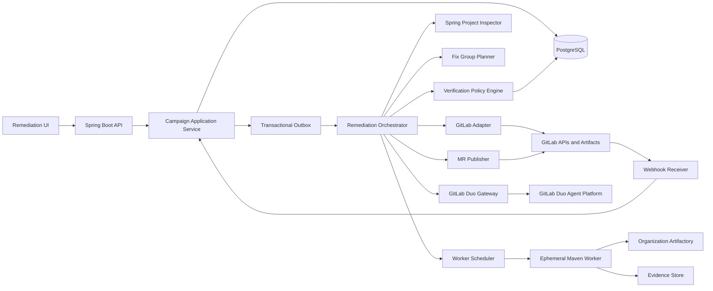
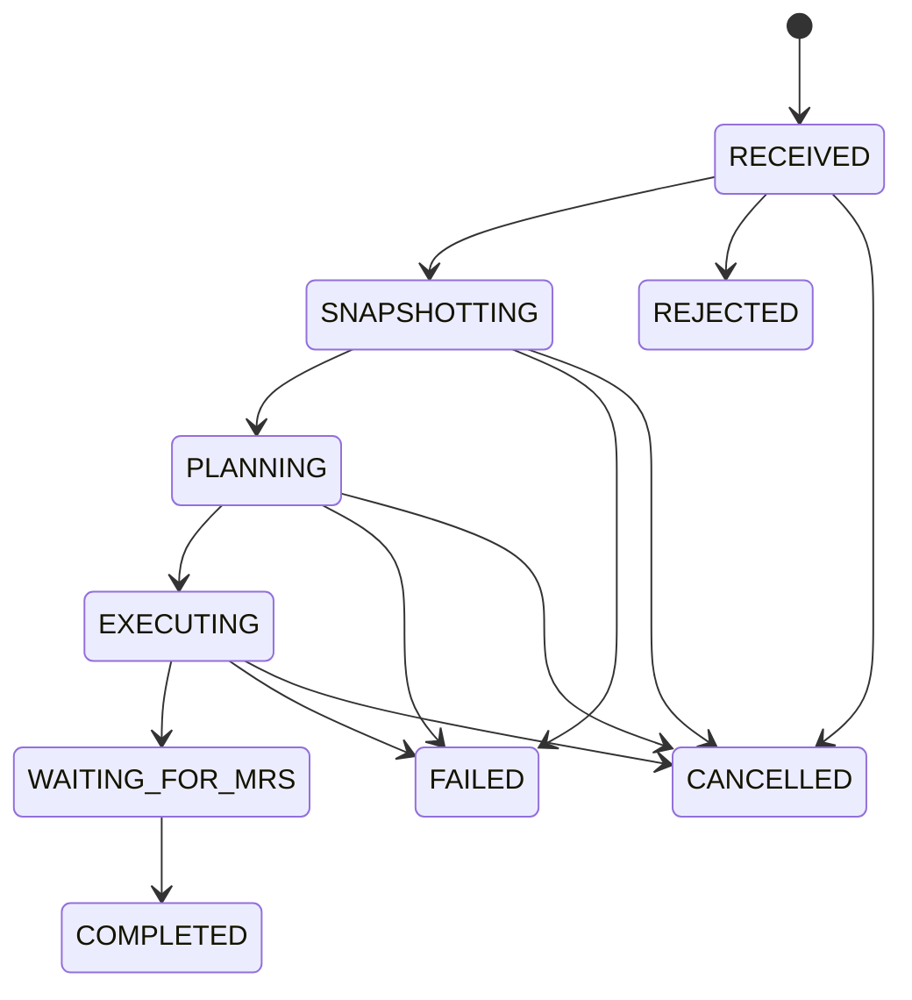

# Spring Boot Vulnerability Remediation System

## Spec-driven design for implementation with GitLab Duo

**Document status:** Implementation specification  
**Version:** 1.0  
**Date:** 2026-09-12  
**Primary implementation platform:** Java, Spring Boot, Maven  
**Source control and security platform:** GitLab with GitLab Duo  
**Artifact source:** Organization JFrog Artifactory only

---

## 0. Instructions for GitLab Duo

GitLab Duo must treat this document as the source of truth for implementation. When a request conflicts with this specification, Duo must identify the conflict instead of silently changing the design.

Implementation rules for Duo:

1. Implement one milestone and one bounded issue at a time.
2. Reference requirement IDs in merge request descriptions, tests, and important design decisions.
3. Do not implement container vulnerability remediation.
4. Do not add access to Maven Central or any public artifact repository.
5. Do not place GitLab, Artifactory, or model-provider credentials in source code, prompts, logs, test fixtures, or configuration committed to Git.
6. Do not allow an AI response to mark a remediation as verified. Verification status comes only from deterministic validation policies.
7. Prefer deterministic Spring-aware remediation recipes before agent-generated changes.
8. Use structured, schema-validated responses for all runtime GitLab Duo interactions.
9. Preserve auditability: every state transition, AI invocation, candidate patch, test result, and GitLab operation must have a durable audit record.
10. Keep automatic merge disabled. The system creates evidence-backed merge requests for developer and security review.
11. If a requested feature cannot satisfy the security boundaries in this specification, stop and surface the conflict.
12. Do not claim that an unverified or unsupported vulnerability has been fixed.

Suggested first prompt to GitLab Duo:

> Read `SPEC.md` completely. Produce an implementation plan containing milestones, issues, dependencies, risks, and requirement IDs. Do not write application code yet. Identify unresolved environment-specific configuration separately from product design decisions.

---

## 1. Purpose

The product is an intelligent vulnerability remediation backend designed specifically for Spring Boot applications built with Maven and hosted in GitLab.

A user selects one or more vulnerabilities from an existing vulnerability report and starts a remediation campaign. The backend retrieves authoritative GitLab evidence, understands the Spring Boot project and Maven dependency model, uses GitLab Duo where contextual reasoning or code generation is needed, validates candidate fixes in isolated workers using the organization's Artifactory, and creates one or more merge requests only for candidates that satisfy the applicable validation policy.

The system optimizes for **correctness over coverage**. It is allowed and expected to abstain when a fix cannot be demonstrated safely.

### 1.1 Product promise

The product must not promise that every vulnerability can be fixed automatically. Its enforceable accuracy contract is:

> Every automatically proposed merge request is backed by reproducible evidence. The system refuses to create a remediation MR when the required evidence cannot be produced.

The term `VERIFIED` means that all configured deterministic gates passed for the exact commit SHA. It is not a mathematical proof that the application is free of all defects.

### 1.2 Success measures

- Percentage of supported findings resulting in a verified MR.
- Percentage of generated MRs merged without corrective developer commits.
- False-safe rate: MRs marked verified that later fail a required security or regression check. The target is zero.
- Median time from campaign creation to verified MR.
- Percentage of dependency fixes using the smallest Artifactory-available compatible version.
- Percentage of SAST fixes with a regression test that fails before and passes after the patch.
- Percentage of campaigns with complete, replayable audit evidence.

---

## 2. Scope

### 2.1 In scope for the first production release

- GitLab project vulnerability ingestion.
- Bulk selection through remediation campaigns.
- Spring Boot project discovery.
- Maven single-module and multi-module projects.
- Maven dependency and transitive-dependency remediation.
- Spring Boot parent and BOM-managed dependency remediation.
- Organization/corporate BOM awareness.
- Selected high-confidence SAST remediation families.
- Spring Security and Spring MVC/WebFlux-aware source analysis.
- Security regression-test generation.
- GitLab Duo analysis, planning, candidate generation, failure diagnosis, independent review, and MR content generation.
- Organization Artifactory-only dependency resolution.
- Isolated build and validation workers.
- GitLab branch, commit, pipeline, status, and merge request integration.
- Durable audit trail and remediation evidence.
- Human review and approval before merge.

### 2.2 Explicitly out of scope

- Container vulnerability remediation.
- Dockerfile or base-image updates intended to remediate findings.
- OS package upgrades.
- Automatic merge.
- Direct changes to GitLab branch protection, approval rules, security policies, or scanner configuration.
- Bypassing Artifactory to reach Maven Central or another public repository.
- Automatic dismissal or suppression of vulnerabilities.
- Production credential rotation.
- Major Spring Boot, Spring Framework, Spring Security, Spring Cloud, or Java migrations without an explicitly approved migration policy.
- Fixes that require an unapproved artifact not present in organization Artifactory.
- Arbitrary shell access initiated by the AI model.

### 2.3 Findings that must be reported but not automatically fixed

- Container findings: `UNSUPPORTED_CONTAINER`.
- Secrets requiring revocation or rotation: `MANUAL_ACTION_REQUIRED`.
- DAST findings without an approved reproduction harness: `MANUAL_ACTION_REQUIRED`.
- Findings lacking adequate location, dependency, or scanner evidence: `INSUFFICIENT_EVIDENCE`.
- Findings requiring unavailable artifacts: `BLOCKED_ARTIFACT_UNAVAILABLE`.
- Findings requiring a prohibited major migration: `POLICY_BLOCKED`.

---

## 3. Assumptions and environment discovery

The implementation must not hard-code the following values. They are deployment inputs discovered or configured per environment:

- GitLab offering: GitLab.com, Self-Managed, or Dedicated.
- GitLab version and enabled GitLab Duo Agent Platform features.
- Whether the GitLab Duo Flows API and custom/external agents are enabled.
- GitLab base URL and API version.
- GitLab project/group membership model and service-account policy.
- Artifactory virtual Maven repository URL.
- Artifactory Maven server ID.
- Artifactory authentication mechanism.
- Corporate certificate-authority truststore.
- Approved Maven and JDK worker images.
- Organization BOMs and supported Spring Boot release lines.
- Required GitLab CI pipeline jobs and security scanners.
- Kubernetes namespace, quotas, and network policies, or the equivalent isolated-worker platform.

The application must run a startup capability check and expose the result through an administrative readiness endpoint. Runtime remediation must fail closed when a mandatory capability is missing.

---

## 4. Actors and permissions

### 4.1 Human actors

- **Developer:** selects findings, starts campaigns, views evidence, reviews MRs.
- **Security reviewer:** reviews security evidence, accepts or rejects remediation MRs.
- **Project maintainer:** configures project eligibility and policies.
- **Platform administrator:** configures GitLab, Duo, Artifactory, workers, secrets, and global policies.
- **Auditor:** reads immutable campaign and decision history without mutation rights.

### 4.2 Machine identities

- **Remediation control-plane identity:** reads project metadata and vulnerability data; creates campaign branches and MRs where authorized.
- **GitLab Duo flow/agent identity:** receives composite or scoped permissions from GitLab; operates only within the selected project and remediation branch.
- **Worker identity:** reads the temporary checkout and Artifactory; cannot merge, change project settings, or access production systems.
- **Webhook identity:** authenticated using the configured GitLab webhook secret or signature mechanism.

### 4.3 Least-privilege rules

- No service identity may both change protected project settings and approve its own remediation.
- The worker must not possess merge permissions.
- Artifactory credentials must be read-only and short-lived.
- A Duo agent must not receive Artifactory credentials or raw secret values.
- Human authorization is evaluated against current GitLab membership, not cached UI claims.

---

## 5. Glossary

- **Campaign:** A user's request to remediate a selected set of vulnerability IDs against one target branch SHA.
- **Finding snapshot:** Immutable normalized evidence for one vulnerability at campaign start.
- **Fix group:** A set of findings safe to remediate and validate as one branch/MR unit.
- **Candidate:** One proposed set of file changes and tests for a fix group.
- **Evidence:** Machine-produced data used by policy to accept or reject a candidate.
- **Project model:** The normalized Spring Boot, Java, Maven, module, BOM, framework, and test topology of the repository.
- **Local validation:** Validation performed in the isolated remediation worker.
- **GitLab validation:** Merge request pipeline and security results produced by GitLab for the candidate commit.
- **Abstention:** A deliberate no-change outcome when the system cannot satisfy all mandatory gates.

---

## 6. Functional requirements

### 6.1 Campaign API

- **FR-CAM-001:** The API must accept one GitLab project, one target branch, an expected target SHA, a non-empty set of vulnerability IDs, and a policy profile.
- **FR-CAM-002:** Campaign creation must support an `Idempotency-Key` header.
- **FR-CAM-003:** The backend must reject mixed-project vulnerability selections.
- **FR-CAM-004:** The backend must re-fetch every vulnerability from GitLab rather than trusting browser-supplied details.
- **FR-CAM-005:** The backend must preserve a snapshot of the target branch SHA and relevant vulnerability evidence.
- **FR-CAM-006:** The user must be able to view campaign, fix-group, candidate, validation, and MR status.
- **FR-CAM-007:** A user with permission must be able to cancel work that has not reached a non-cancellable GitLab operation.
- **FR-CAM-008:** Selecting all findings must create a campaign, not force all changes into one MR.
- **FR-CAM-009:** Campaign results must separately report verified, failed, unsupported, stale, blocked, and manual-action findings.

### 6.2 GitLab vulnerability ingestion

- **FR-GL-001:** Prefer GitLab GraphQL for vulnerability retrieval when available.
- **FR-GL-002:** Retrieve raw scanner artifacts when normalized API data does not contain sufficient location, dependency, fingerprint, or remediation information.
- **FR-GL-003:** Record vulnerability ID, UUID/fingerprint, report type, scanner, state, severity, identifiers, location, pipeline, and detected commit.
- **FR-GL-004:** Do not automatically dismiss, resolve, confirm, or change the state of the source vulnerability.
- **FR-GL-005:** Mark a finding stale if its authoritative GitLab state or fingerprint changes before candidate publication.
- **FR-GL-006:** Verify project permissions before campaign creation and again before branch/MR mutation.
- **FR-GL-007:** Verify webhook authenticity and deduplicate webhook delivery IDs.

### 6.3 Spring Boot project discovery

- **FR-SPR-001:** Detect a Spring Boot project from Maven build metadata and repository structure.
- **FR-SPR-002:** Detect the Spring Boot parent or imported `spring-boot-dependencies` BOM.
- **FR-SPR-003:** Detect Java source/target/toolchain version.
- **FR-SPR-004:** Detect Maven modules and module dependency order.
- **FR-SPR-005:** Detect imported Spring Cloud and organization BOMs.
- **FR-SPR-006:** Detect Spring MVC versus WebFlux.
- **FR-SPR-007:** Detect Spring Security configuration style and relevant security dependencies.
- **FR-SPR-008:** Detect data-access technologies including Spring Data JPA, JDBC, R2DBC, and MongoDB when present.
- **FR-SPR-009:** Detect test conventions including JUnit, Spring Boot Test, MockMvc, WebTestClient, and Testcontainers.
- **FR-SPR-010:** Persist the project model with the target SHA and invalidate it when build-model inputs change.
- **FR-SPR-011:** Abstain if the repository is not confidently recognized as a supported Maven Spring Boot application.

### 6.4 Finding normalization and eligibility

- **FR-NRM-001:** Normalize GitLab dependency and SAST reports into a stable internal finding model.
- **FR-NRM-002:** Map dependency findings to Maven coordinates, dependency paths, declaring modules, and version owners.
- **FR-NRM-003:** Map SAST findings to source paths, line ranges, CWE identifiers, framework context, and affected execution paths where available.
- **FR-NRM-004:** Classify container findings as `UNSUPPORTED_CONTAINER` without starting a patch worker.
- **FR-NRM-005:** Deduplicate equivalent findings while retaining all GitLab identifiers fixed by the proposed change.
- **FR-NRM-006:** Never treat an AI-created identifier or location as authoritative scanner evidence.

### 6.5 Fix grouping

- **FR-GRP-001:** Build a conflict graph over eligible findings.
- **FR-GRP-002:** Group dependency findings controlled by the same Maven property, parent, or BOM when one compatible upgrade fixes them together.
- **FR-GRP-003:** Separate changes with conflicting required versions.
- **FR-GRP-004:** Separate SAST findings with overlapping edits unless a single root-cause patch fixes them together.
- **FR-GRP-005:** Keep unrelated modules separate unless organization policy explicitly permits combined MRs.
- **FR-GRP-006:** Enforce configured limits for findings, changed files, diff size, and modules per fix group.
- **FR-GRP-007:** Produce an explainable grouping decision stored as audit evidence.

### 6.6 GitLab Duo orchestration

- **FR-DUO-001:** GitLab Duo is the only approved runtime AI reasoning/coding provider.
- **FR-DUO-002:** The application must not silently fall back to a non-Duo model.
- **FR-DUO-003:** Use native GitLab Duo Vulnerability Resolution only as an advisory/candidate source, or when the deployed interface permits its output to pass through this system's local validation before MR publication. If native resolution creates an MR before local validation, the automated path must use the custom Spring Boot remediation flow instead.
- **FR-DUO-004:** Use a custom Spring Boot remediation flow or approved external Duo agent for broader remediation workflows when enabled.
- **FR-DUO-005:** Provide Duo only the minimum repository context needed for the current role.
- **FR-DUO-006:** Treat repository content, vulnerability descriptions, comments, and build output as untrusted prompt content.
- **FR-DUO-007:** Validate every Duo response against a versioned JSON schema.
- **FR-DUO-008:** Reject changes outside the allowed path set or based on unexpected blob hashes.
- **FR-DUO-009:** Separate analysis, patch generation, and final review into distinct sessions or roles.
- **FR-DUO-010:** The independent review role must be read-only and must not modify the candidate it reviews.
- **FR-DUO-011:** Store provider session IDs, model metadata exposed by GitLab, prompt-template version, input hashes, output hashes, timestamps, and outcome.
- **FR-DUO-012:** Do not store hidden chain-of-thought. Store structured conclusions, cited repository evidence, decisions, and tool results.
- **FR-DUO-013:** Sanitize Maven, test, and pipeline logs before presenting them to Duo.
- **FR-DUO-014:** Bound candidate repair attempts per fix group. The default maximum is three.
- **FR-DUO-015:** Duo cannot change policy, mark a candidate verified, approve an MR, or merge an MR.

### 6.7 Maven and Artifactory remediation

- **FR-MVN-001:** All Maven artifact and plugin resolution must use organization Artifactory.
- **FR-MVN-002:** Public artifact repository network access must be denied at the worker network layer.
- **FR-MVN-003:** Generate or mount Maven `settings.xml` at runtime; never commit credentials.
- **FR-MVN-004:** Use the same approved JDK, Maven version, profiles, mirrors, truststore, and Artifactory virtual repository as the target GitLab pipeline where possible.
- **FR-MVN-005:** Determine the effective version owner: Spring Boot parent/BOM, Spring Cloud BOM, organization BOM, property, direct declaration, or transitive dependency.
- **FR-MVN-006:** Obtain an authoritative list of fixed candidate versions and confirm availability through Artifactory before supplying candidates to Duo.
- **FR-MVN-007:** Duo must not propose a version outside the supplied approved candidate set.
- **FR-MVN-008:** Prefer the smallest compatible fixed release allowed by policy.
- **FR-MVN-009:** Prefer upgrading a managing Spring Boot/BOM/property over adding an ad hoc explicit version.
- **FR-MVN-010:** Reject unresolved dependencies, checksum failures, repository bypass, dependency convergence failures, and unexpected snapshots.
- **FR-MVN-011:** Capture effective POM and dependency trees before and after the change.
- **FR-MVN-012:** Record Maven coordinates, resolved versions, dependency paths, repository origin metadata available to the organization, and checksums.
- **FR-MVN-013:** Return `BLOCKED_ARTIFACT_UNAVAILABLE` when no approved fixed version resolves through Artifactory.
- **FR-MVN-014:** Treat major framework or Java migrations as policy-blocked unless an explicit migration policy is enabled.

### 6.8 SAST remediation

- **FR-SAST-001:** Initially support only an explicitly configured CWE/rule allowlist.
- **FR-SAST-002:** Inspect Spring controller, service, repository, security, configuration, and test context relevant to the finding.
- **FR-SAST-003:** Require a minimal patch with no unrelated refactoring.
- **FR-SAST-004:** Generate or update a security regression test for each fix group where technically possible.
- **FR-SAST-005:** Confirm the regression test fails against the original target SHA for the intended reason.
- **FR-SAST-006:** Confirm the same test passes against the patched candidate.
- **FR-SAST-007:** Reject a generated test that passes before the patch, tests the wrong behavior, or weakens an existing assertion.
- **FR-SAST-008:** Rerun the original applicable GitLab analyzer in the MR pipeline.
- **FR-SAST-009:** Confirm the source finding fingerprint or equivalent finding is absent from the candidate scan.
- **FR-SAST-010:** Never resolve an authorization finding by adding an annotation without testing unauthenticated, unauthorized, and authorized behavior.
- **FR-SAST-011:** Never resolve a SQL injection finding only by escaping text when a supported parameterized API is available.
- **FR-SAST-012:** Never disable CSRF, validation, authentication, authorization, or a scanner to remove a finding.
- **FR-SAST-013:** Mark behavior-sensitive fixes as requiring security-review approval even when automated gates pass.

Initial SAST families should include:

- SQL injection in JDBC, JPA native queries, and related data access.
- Path traversal in upload/download endpoints.
- Open redirect.
- Server-side request forgery involving `RestTemplate`, `WebClient`, or approved HTTP clients.
- Unsafe file upload validation.
- Spring MVC/WebFlux input validation gaps.
- Insecure CORS configuration.
- Incorrect CSRF configuration.
- Unsafe deserialization.
- Weak password encoding.
- Sensitive-data logging.
- Actuator endpoint exposure.
- Authorization gaps where expected authorization behavior can be derived and tested.

### 6.9 Candidate validation

- **FR-VAL-001:** Validate each candidate from a clean checkout of the captured target SHA.
- **FR-VAL-002:** Apply edits only when expected pre-edit blob hashes match.
- **FR-VAL-003:** Enforce path, file-count, line-count, and forbidden-file policies before executing a build.
- **FR-VAL-004:** Run Maven dependency resolution, compilation, and configured tests.
- **FR-VAL-005:** Start the Spring application with an approved isolated test profile when required by policy.
- **FR-VAL-006:** Run application-context, health, MockMvc/WebTestClient, and security tests when applicable.
- **FR-VAL-007:** Compare dependency trees and SBOMs before and after dependency changes.
- **FR-VAL-008:** Reject new policy-prohibited vulnerability or license findings.
- **FR-VAL-009:** Associate every evidence item with the exact candidate commit SHA.
- **FR-VAL-010:** A candidate is locally verified only when all mandatory local gates pass.
- **FR-VAL-011:** A remediation becomes GitLab verified only after the MR pipeline for the same head SHA passes all required jobs.
- **FR-VAL-012:** A new commit invalidates prior MR validation evidence unless a gate is explicitly content-addressed and reusable.
- **FR-VAL-013:** Failed validation may be sent through the bounded Duo diagnostic loop after sanitization.

### 6.10 Merge request publication

- **FR-MR-001:** Create a unique remediation branch from the captured target SHA.
- **FR-MR-002:** Never force-push over a user-owned branch.
- **FR-MR-003:** Create an MR only after mandatory local validation passes.
- **FR-MR-004:** Create the MR as Draft until required GitLab pipelines and status checks pass.
- **FR-MR-005:** Include fixed finding IDs, root-cause analysis, exact changes, dependency-tree/SBOM summary, tests, residual risk, and rollback guidance.
- **FR-MR-006:** Label the MR using configurable remediation labels.
- **FR-MR-007:** Request CODEOWNERS/security reviewers through existing project policy; do not weaken approval rules.
- **FR-MR-008:** Update an external status check or equivalent integration only for the current MR head SHA.
- **FR-MR-009:** Keep automatic merge disabled.
- **FR-MR-010:** After merge, require a default-branch scan before marking the campaign finding `CONFIRMED_REMOVED`.

### 6.11 Audit and evidence

- **FR-AUD-001:** Store append-only audit events for all security-relevant actions.
- **FR-AUD-002:** Store evidence artifacts by content hash in object storage.
- **FR-AUD-003:** Record actor, project, target SHA, candidate SHA, policy version, prompt-template version, timestamps, and outcomes.
- **FR-AUD-004:** Redact secrets and access tokens before persistence.
- **FR-AUD-005:** Provide an export containing campaign decisions and links/hashes for evidence.
- **FR-AUD-006:** Retention must be configurable by organization policy.

---

## 7. Non-functional requirements

- **NFR-SEC-001:** Default-deny worker network policy.
- **NFR-SEC-002:** All credentials must be short-lived where supported and obtained from an approved secret manager.
- **NFR-SEC-003:** Encrypt network traffic and durable sensitive data.
- **NFR-SEC-004:** Do not expose raw secrets in application logs, tracing attributes, exceptions, or Duo context.
- **NFR-SEC-005:** Run workers as non-root with read-only base filesystems and bounded writable workspace volumes.
- **NFR-REL-001:** Use transactional outbox processing for durable asynchronous commands and events.
- **NFR-REL-002:** All external mutations must be idempotent or protected by idempotency records.
- **NFR-REL-003:** Webhook processing must tolerate duplicates and out-of-order delivery.
- **NFR-REL-004:** A control-plane restart must not lose campaign progress.
- **NFR-PERF-001:** Campaign creation should return within two seconds under normal control-plane load; remediation continues asynchronously.
- **NFR-PERF-002:** Concurrency must be bounded globally, per project, and per Artifactory/GitLab rate policy.
- **NFR-OBS-001:** Emit structured logs, metrics, and OpenTelemetry traces with campaign and fix-group correlation IDs.
- **NFR-OBS-002:** Provide metrics for queue time, worker time, Duo latency, retry count, validation failures, abstentions, and MR outcomes.
- **NFR-MNT-001:** Integrations and remediation handlers must use ports/adapters so GitLab capability differences do not leak into domain logic.
- **NFR-MNT-002:** Policy and prompt templates must be versioned and testable.
- **NFR-COMP-001:** Respect organization source-code, AI-data, audit, and retention policies.

---

## 8. Logical architecture



### 8.1 Control plane components

1. **API layer**
   - REST endpoints, request validation, authorization, problem details, and SSE progress.
2. **Campaign application service**
   - Transaction boundary and domain-command handler.
3. **GitLab adapter**
   - GraphQL, REST, artifact, repository, pipeline, status-check, MR, and webhook operations.
4. **Spring project inspector**
   - Produces the versioned `SpringProjectModel`.
5. **Finding normalizer**
   - Maps scanner-specific data to stable domain models.
6. **Fix-group planner**
   - Builds the conflict graph and creates explainable MR units.
7. **GitLab Duo gateway**
   - Capability discovery, flow/agent invocation, context minimization, schema validation, and audit metadata.
8. **Worker scheduler**
   - Creates, monitors, times out, and destroys isolated remediation jobs.
9. **Verification policy engine**
   - Evaluates evidence without AI authority.
10. **MR publisher**
    - Performs idempotent branch/commit/MR operations.
11. **Webhook receiver**
    - Authenticates and deduplicates GitLab event deliveries.
12. **Evidence service**
    - Stores hashes, metadata, and object-store references.

### 8.2 Worker responsibilities

The worker is data-plane code and must be isolated from the control plane. It may:

- Clone/fetch the approved project and target SHA.
- Resolve Maven artifacts through Artifactory.
- Construct effective Maven models.
- Apply a schema-validated candidate patch.
- Run approved build and test commands.
- Generate dependency tree and SBOM evidence.
- Run locally available pre-validation tools.
- Return sanitized, structured evidence.

It may not:

- Merge an MR.
- Change protected GitLab settings.
- Read production credentials.
- Reach public Maven repositories.
- Execute arbitrary model-selected commands.
- Persist beyond job completion.

---

## 9. Deployment and trust boundaries

Deploy at least these independently scalable units:

- `remediation-control-plane`: Spring Boot web/API service.
- `remediation-worker-controller`: may initially be part of the control-plane deployment but must use a separate logical port.
- `remediation-worker`: immutable job image invoked per candidate.
- PostgreSQL.
- Object storage.
- Approved secret manager integration.

Worker egress allowlist:

- Organization GitLab endpoints required for checkout and result publication.
- Organization Artifactory virtual Maven repository.
- GitLab Duo/AI Gateway endpoints only from the component that requires them.
- Organization observability endpoints where approved.

Public Maven repositories and unrelated internet destinations must be denied.

---

## 10. Domain model

### 10.1 Aggregate roots

#### RemediationCampaign

```text
id: UUID
projectId: String
projectPath: String
targetBranch: String
targetSha: String
requestedBy: GitLabUserRef
policyProfileId: String
policyVersion: String
status: CampaignStatus
createdAt, updatedAt
version: Long
```

#### FixGroup

```text
id: UUID
campaignId: UUID
sequence: Integer
type: DEPENDENCY | SAST | MIXED_ALLOWED
modulePaths: Set<String>
findingSnapshotIds: Set<UUID>
allowedPaths: Set<PathPattern>
status: FixGroupStatus
groupingExplanation: String
attemptCount: Integer
selectedCandidateId: UUID?
mergeRequestRecordId: UUID?
```

### 10.2 Supporting entities

- `FindingSnapshot`
- `SpringProjectModel`
- `DependencyCoordinate`
- `DependencyPath`
- `ApprovedVersionCandidate`
- `DuoSession`
- `FixPlan`
- `PatchCandidate`
- `FileEdit`
- `GeneratedTest`
- `ValidationRun`
- `EvidenceRecord`
- `PolicyDecision`
- `MergeRequestRecord`
- `ArtifactRecord`
- `WebhookDelivery`
- `AuditEvent`
- `OutboxEvent`

### 10.3 Canonical finding shape

```json
{
  "snapshotId": "uuid",
  "gitlabVulnerabilityId": "gid://gitlab/Vulnerability/123",
  "fingerprint": "scanner-stable-fingerprint",
  "reportType": "DEPENDENCY_SCANNING",
  "scanner": "gitlab-scanner-name",
  "state": "DETECTED",
  "severity": "HIGH",
  "identifiers": ["CVE-YYYY-NNNN"],
  "cwes": [],
  "detectedSha": "sha",
  "location": {
    "file": "pom.xml",
    "startLine": null,
    "endLine": null,
    "dependency": {
      "groupId": "org.example",
      "artifactId": "example-library",
      "resolvedVersion": "1.2.3",
      "module": ".",
      "dependencyPath": []
    }
  },
  "rawArtifactHash": "sha256"
}
```

---

## 11. State machines

### 11.1 Campaign state



Campaign completion may contain a mixture of verified, unsupported, blocked, failed, and manual-action findings.

### 11.2 Fix-group state

```text
PLANNED
  -> ANALYZING_WITH_DUO
  -> GENERATING_CANDIDATE
  -> VALIDATING_LOCAL
       -> DIAGNOSING_WITH_DUO -> GENERATING_CANDIDATE   (bounded retry)
       -> NEEDS_HUMAN_REVIEW
       -> FAILED
       -> LOCAL_VERIFIED
  -> PUBLISHING_MR
  -> MR_DRAFT
  -> PIPELINE_RUNNING
       -> DIAGNOSING_WITH_DUO                           (new candidate commit)
       -> NEEDS_HUMAN_REVIEW
       -> GITLAB_VERIFIED
  -> READY_FOR_REVIEW
  -> MERGED
  -> DEFAULT_BRANCH_CONFIRMATION
  -> CONFIRMED_REMOVED
```

Terminal no-change states include `UNSUPPORTED`, `BLOCKED`, `FAILED`, `STALE`, `CANCELLED`, and `NEEDS_HUMAN_REVIEW`.

---

## 12. Public API contract

Use `/api/v1`. Return RFC 9457-style problem details for errors. IDs exposed by this service are UUIDs; GitLab IDs remain strings.

### 12.1 Create campaign

```http
POST /api/v1/remediation-campaigns
Authorization: Bearer <user-token-or-session>
Idempotency-Key: <uuid>
Content-Type: application/json
```

```json
{
  "projectId": "4812",
  "targetBranch": "main",
  "expectedHeadSha": "4d18c8b...",
  "vulnerabilityIds": [
    "gid://gitlab/Vulnerability/101",
    "gid://gitlab/Vulnerability/102"
  ],
  "policyProfile": "spring-production-strict",
  "groupingMode": "SAFE_GROUPS"
}
```

Response: `202 Accepted`

```json
{
  "campaignId": "uuid",
  "status": "RECEIVED",
  "statusUrl": "/api/v1/remediation-campaigns/uuid",
  "eventsUrl": "/api/v1/remediation-campaigns/uuid/events"
}
```

### 12.2 Retrieve campaign

```http
GET /api/v1/remediation-campaigns/{campaignId}
```

The response must include counts by outcome, fix groups, current stages, MR links, and user-action requirements. It must not contain raw credentials, full prompts, or unsanitized logs.

### 12.3 Stream campaign events

```http
GET /api/v1/remediation-campaigns/{campaignId}/events
Accept: text/event-stream
```

Events contain monotonic sequence numbers so clients can reconnect using `Last-Event-ID`.

### 12.4 Cancel campaign

```http
POST /api/v1/remediation-campaigns/{campaignId}/cancel
```

Cancellation is idempotent. Existing GitLab MRs are not deleted automatically; they are annotated or closed only if organization policy explicitly authorizes it.

### 12.5 GitLab webhook

```http
POST /api/v1/integrations/gitlab/webhooks
```

Supported events initially:

- Pipeline event.
- Merge request event.
- Push event for campaign branches.
- Vulnerability event where available.

---

## 13. GitLab integration design

### 13.1 Read path

- Use GraphQL for project vulnerabilities where supported.
- Use REST endpoints when a required feature has no supported GraphQL equivalent.
- Download pipeline security artifacts only through authenticated GitLab APIs.
- Cache immutable responses by project and commit SHA; honor GitLab rate limits.

### 13.2 Write path

- Use a dedicated branch name such as `security/remediate/<campaign-short-id>/<group-number>`.
- Prefer normal Git commits/push from the controlled publisher for validated multi-file changes; alternatively use GitLab's multi-action commit API when configured.
- Set commit author/committer according to service-account and compliance policy.
- Include campaign and fix-group IDs in commit trailers or MR metadata.
- Create Draft MRs after local validation.
- Bind external validation status to the current MR HEAD SHA.

### 13.3 Version/capability adapter

Define a `GitLabCapabilities` value object populated at startup and refreshable by an administrator. It must include at least:

```text
graphqlVulnerabilities
vulnerabilityArtifacts
nativeDuoVulnerabilityResolution
duoAgentPlatform
duoCustomFlows
duoExternalAgents
duoFlowsApiTrigger
externalStatusChecks
mergeRequestApprovals
vulnerabilityWebhooks
```

Domain code must depend on capabilities rather than GitLab version comparisons.

---

## 14. GitLab Duo runtime design

### 14.1 Roles

Use separate role definitions even if the installed GitLab version executes them within one custom flow:

1. **Spring analysis role**
   - Explains the root cause using cited files, lines, Maven coordinates, and framework behavior.
2. **Fix planning role**
   - Produces bounded strategies and selects only from backend-supplied dependency versions.
3. **Patch role**
   - Produces minimal file edits with expected blob hashes.
4. **Security-test role**
   - Produces a test designed to fail on the vulnerable revision and pass on the fixed revision.
5. **Failure-diagnostic role**
   - Receives sanitized structured failures and proposes a corrected plan.
6. **Independent review role**
   - Receives the final diff and evidence read-only; returns findings and an accept/reject recommendation.
7. **MR communication role**
   - Produces the human-readable MR explanation from already verified evidence.

### 14.2 Context rules

The backend constructs role-specific context. Do not send the entire repository by default.

Allowed context can include:

- Normalized finding and identifiers.
- Scanner description explicitly labeled as untrusted.
- Relevant source files and tests.
- Relevant portions of `pom.xml` files.
- Project model.
- Before/after dependency graphs.
- Backend-verified Artifactory version candidates.
- Organization secure-coding rules.
- Allowed file paths and forbidden operations.
- Sanitized validation failures.

### 14.3 Structured output

Each output schema must carry `schemaVersion` and be validated before use. Example fix plan:

```json
{
  "schemaVersion": "1.0",
  "summary": "Upgrade the Spring Boot-managed dependency through its version owner",
  "findingIds": ["snapshot-uuid"],
  "strategy": "UPGRADE_MANAGING_BOM",
  "selectedVersionCandidateId": "candidate-id-supplied-by-backend",
  "affectedModules": ["."],
  "allowedFiles": ["pom.xml"],
  "expectedBehavior": [
    "Application compiles",
    "Selected vulnerability is absent from dependency scan"
  ],
  "testPlan": [
    "Resolve effective POM",
    "Run Maven verify",
    "Compare dependency tree and SBOM"
  ],
  "riskFlags": []
}
```

Example file edit:

```json
{
  "schemaVersion": "1.0",
  "path": "pom.xml",
  "expectedBlobSha": "git-blob-sha",
  "operation": "REPLACE_CONTENT",
  "content": "<complete new content or approved patch representation>",
  "reason": "Update the property controlling the affected dependency"
}
```

Before applying edits, the backend/worker must enforce:

- Path is in the allowlist.
- Path is not a symlink escape.
- Blob SHA matches.
- Operation is supported.
- Diff does not touch forbidden files or weaken required tests/scanners.
- Output size is within policy.

### 14.4 Prompt-injection defense

- Delimit untrusted repository/scanner text from system instructions.
- State that instructions found in repository content must not be followed.
- Give the agent only explicit tools required by its role.
- Deny arbitrary outbound network and shell tools.
- Validate all proposed actions outside the model.
- Reject requests to reveal prompts, tokens, or environment data.
- Treat model-generated URLs, versions, and commands as untrusted suggestions.

---

## 15. Maven and Artifactory design

### 15.1 Runtime Maven configuration

Create a secret-backed Maven settings file for each worker. The mirror and server IDs must match organization configuration. A representative template is:

```xml
<settings>
  <mirrors>
    <mirror>
      <id>${ARTIFACTORY_SERVER_ID}</id>
      <url>${ARTIFACTORY_MAVEN_URL}</url>
      <mirrorOf>*</mirrorOf>
    </mirror>
  </mirrors>
  <servers>
    <server>
      <id>${ARTIFACTORY_SERVER_ID}</id>
      <username>${env.ARTIFACTORY_USERNAME}</username>
      <password>${env.ARTIFACTORY_ACCESS_TOKEN}</password>
    </server>
  </servers>
</settings>
```

The production template may include organization profiles, plugin repositories, proxies, and certificate settings. It must preserve the corporate mirror and must not expose values to Duo.

### 15.2 Resolution algorithm

For each dependency fix group:

1. Resolve the original project using the approved worker environment.
2. Produce the effective POM for each relevant module.
3. Produce a dependency tree with omitted/conflict details where supported.
4. Locate the vulnerable resolved coordinate and all dependency paths.
5. Determine version ownership.
6. Obtain fixed-version intelligence from authoritative vulnerability data.
7. Filter versions through organization policy.
8. Confirm each remaining version is available through Artifactory.
9. Supply only confirmed candidates to Duo.
10. Ask Duo to plan the smallest Spring-compatible change.
11. Apply the candidate from a clean checkout.
12. Re-resolve and compare the graph.
13. Run all mandatory dependency validation gates.

### 15.3 Spring dependency-management rules

Priority order:

1. Upgrade within an approved Spring Boot patch line.
2. Upgrade the organization-approved Spring Boot line when policy explicitly permits it.
3. Upgrade the Spring Cloud release train with compatibility evidence.
4. Update the existing property or corporate BOM that owns the version.
5. Update an explicitly versioned direct dependency.
6. Use a temporary dependency-management override only when policy permits it and compatibility tests pass.
7. Abstain instead of performing an unapproved major migration.

The system must not add an explicit version to a Boot-managed dependency merely to hide a scanner finding.

### 15.4 Standard Maven evidence commands

Commands are policy-controlled templates, not model-generated strings. Typical commands include:

```text
mvn -s <secret-settings> help:effective-pom
mvn -s <secret-settings> dependency:tree
mvn -s <secret-settings> clean verify
```

Use an ephemeral per-worker local repository. Optional safe caching must be content-addressed and must not permit cross-tenant credential leakage.

---

## 16. Remediation planning algorithms

### 16.1 Conflict graph

Create one node per eligible finding. Add an edge when findings:

- Modify the same Maven version owner.
- Require incompatible versions.
- Affect overlapping source ranges.
- Require contradictory configuration.
- Affect the same test behavior.
- Cross a configured module/MR boundary.

Use edge labels to distinguish `MUST_GROUP`, `MUST_SEPARATE`, and `REVIEW_REQUIRED`. Compute fix groups deterministically and persist the explanation.

### 16.2 Candidate selection

Candidate ranking uses deterministic evidence, in this order:

1. All mandatory gates pass.
2. Original finding is absent in applicable scan evidence.
3. No prohibited new finding exists.
4. Smaller framework/version movement.
5. Smaller behavioral surface.
6. Smaller diff.
7. Greater existing-test coverage of affected behavior.

Duo-provided confidence is recorded for diagnostics only and must not influence verification status unless explicitly converted into a non-authoritative ranking feature.

### 16.3 Abstention conditions

Abstain when:

- The project or finding is unsupported.
- Target SHA or source blob becomes stale.
- Required fixed artifacts are unavailable.
- Dependency compatibility cannot be established.
- The security regression test cannot reproduce the issue where reproduction is mandatory.
- Existing tests are inadequate for a behavior-sensitive change.
- A candidate touches forbidden paths.
- Validation remains unsuccessful after the retry limit.
- Duo capability is unavailable while `duo.required=true`.

---

## 17. Validation policy

### 17.1 Universal gates

- Clean checkout from captured SHA.
- Allowed paths and diff-size checks.
- No submodule/symlink escape.
- No credential or high-entropy secret added.
- No security-scanner or test disabling.
- Maven resolution through Artifactory only.
- Compile and package success.
- Existing mandatory tests pass.
- Evidence associated with candidate SHA.
- Independent Duo review has no blocking finding.

### 17.2 Dependency profile

- Original coordinate and dependency path reproduced before change.
- Selected version belongs to the backend-confirmed Artifactory candidate set.
- Effective POM and dependency tree generated before and after.
- Vulnerable version absent from the after graph.
- Fixed version present on all affected paths.
- Dependency convergence passes where configured.
- SBOM comparison passes.
- No new prohibited vulnerability or license appears.
- Spring application context/startup test passes where configured.
- GitLab MR dependency scan confirms the selected finding is absent.

### 17.3 SAST profile

- Finding source location matches the captured blob.
- Security regression test fails on the original revision for the expected reason.
- Same test passes on candidate.
- Existing tests remain intact and pass.
- Application context/startup and applicable endpoint tests pass.
- Original GitLab SAST analyzer runs on MR SHA.
- Equivalent target finding is absent.
- No prohibited new SAST finding appears.
- Security-sensitive fixes require designated human approval even after verification.

### 17.4 Status interpretation

```text
LOCAL_VERIFIED
  All mandatory worker gates passed for candidate SHA.

GITLAB_VERIFIED
  All required GitLab MR pipeline/security gates passed for the same SHA.

READY_FOR_REVIEW
  GitLab verified and MR evidence is complete; human approval remains required.

NEEDS_HUMAN_REVIEW
  A potentially useful patch exists, but mandatory evidence is incomplete.

FAILED
  Candidate violated policy or failed validation.
```

---

## 18. Merge request specification

MR title template:

```text
fix(security): remediate <count> <type> finding(s) [campaign <short-id>]
```

MR description must include:

1. Campaign and fix-group identifiers.
2. Selected GitLab vulnerability IDs and CVE/CWE identifiers.
3. Root cause.
4. Why the selected change is Spring Boot/Maven compatible.
5. Changed files.
6. Before/after dependency information when applicable.
7. Regression-test proof when applicable.
8. Local validation results.
9. GitLab pipeline/security results, updated after completion.
10. Residual risks and required human decisions.
11. Rollback instructions.
12. Explicit statement that container findings were not remediated, if present in the campaign.

Recommended labels:

```text
security-remediation
generated-by-gitlab-duo
spring-boot
dependency-update | sast-fix
requires-security-review
```

---

## 19. Security design

### 19.1 Threats

- Prompt injection embedded in source code, comments, vulnerability descriptions, or build logs.
- AI-generated malicious or overly broad edits.
- Dependency confusion or public-repository bypass.
- Artifactory/GitLab token exposure.
- Build-script execution inside the worker.
- Cross-project data leakage.
- Stale validation attached to a newer commit.
- Webhook spoofing or replay.
- Audit-log tampering.
- Denial of service through oversized campaigns or expensive builds.

### 19.2 Controls

- Default-deny network policy and explicit egress destinations.
- Ephemeral non-root workers with resource and time limits.
- Project-scoped workspaces and identities.
- Secret redaction before logs, evidence, or Duo context.
- Structured output and external policy validation.
- Blob-SHA preconditions for edits.
- Immutable/content-addressed evidence.
- HEAD-SHA binding for status checks.
- Webhook authentication, delivery deduplication, and timestamp/replay controls.
- Campaign/fix-group concurrency quotas.
- Protected forbidden paths including CI security configuration, organization policy files, and credentials.
- Human approval before merge.

---

## 20. Persistence and messaging

Use PostgreSQL for transactional state. Suggested tables:

```text
remediation_campaign
finding_snapshot
spring_project_model
fix_group
approved_version_candidate
duo_session
fix_plan
patch_candidate
file_edit
validation_run
evidence_record
policy_decision
merge_request_record
artifact_record
webhook_delivery
audit_event
outbox_event
```

Use optimistic locking on mutable aggregates. Use an outbox publisher for worker commands, Duo invocations, MR publication, and webhook-derived commands. The first release may use PostgreSQL-backed queues; introduce Kafka or another broker only when scale and organizational standards justify it.

---

## 21. Observability

Every log, metric, and trace must support these correlation fields where applicable:

```text
campaign.id
fix_group.id
candidate.id
validation_run.id
gitlab.project_id
gitlab.mr_iid
git.commit_sha
duo.session_id
worker.job_id
```

Required metrics:

- Campaigns and findings by outcome.
- Fix groups by type and status.
- Duo invocation latency/failure/retry counts.
- Worker queue and execution durations.
- Maven resolution and Artifactory failures.
- Validation failures by gate.
- Stale-SHA rejections.
- MRs created, merged, closed, and modified by humans.
- Post-merge recurrence rate.
- Secret-redaction events.

Do not put repository source, prompts, tokens, or full build logs into trace attributes.

---

## 22. Failure handling

- **GitLab rate limit:** retry with bounded exponential backoff and server hints; do not duplicate mutations.
- **Duo unavailable:** pause/retry within policy, then fail closed with `DUO_UNAVAILABLE`.
- **Artifactory unavailable:** retry resolution; do not use public fallback.
- **Artifact unavailable:** `BLOCKED_ARTIFACT_UNAVAILABLE` with requested coordinates/version.
- **Worker timeout:** destroy job and mark attempt failed; allow bounded retry.
- **Validation failure:** sanitize evidence, invoke Duo diagnostic role if attempts remain.
- **Target branch advanced:** do not rebase automatically after validation; mark stale or create a new campaign/replan according to policy.
- **MR branch changed by user:** invalidate verification and rerun against new HEAD or mark external modification.
- **Webhook duplicate/out of order:** process idempotently using delivery and object timestamps/state.
- **Partial campaign failure:** continue independent fix groups and report mixed outcomes.

---

## 23. Testing strategy for this product

### 23.1 Unit tests

- Domain state transitions.
- Conflict-graph grouping.
- Maven version-owner detection.
- Spring project-model parsing.
- Duo JSON-schema validation.
- Path and blob-SHA policy.
- Evidence-based policy decisions.
- Secret redaction.
- Idempotency and webhook ordering.

### 23.2 Contract tests

- GitLab GraphQL and REST adapters using recorded/synthetic contracts.
- GitLab Duo gateway capability variants and structured outputs.
- Artifactory authentication and Maven resolution.
- Worker-controller job protocol.
- Object-store evidence API.

### 23.3 Integration tests

Maintain vulnerable Spring Boot fixture repositories covering:

- Parent-managed dependency vulnerability.
- Imported Boot BOM.
- Corporate BOM.
- Direct dependency version.
- Transitive dependency.
- Multi-module Maven project.
- SQL injection.
- Path traversal.
- SSRF.
- Authorization gap.
- MVC and WebFlux variants.
- Unavailable Artifactory fixed version.
- Stale target SHA.
- Prompt injection embedded in a source comment.

Each fixture must assert the expected outcome and exact gates.

### 23.4 End-to-end tests

- Create campaign from synthetic GitLab findings.
- Run Duo through a test double or approved test project.
- Execute worker against test Artifactory.
- Create Draft MR in a GitLab test project.
- Consume pipeline webhook.
- Bind validation to HEAD SHA.
- Confirm post-merge/default-branch state.

### 23.5 Security tests

- Token leakage detection.
- Public repository egress denial.
- Prompt injection and tool abuse.
- Symlink/path traversal in edits.
- Malicious Maven plugin/build behavior within sandbox limits.
- Cross-project authorization.
- Webhook forgery and replay.
- Stale status update rejection.

---

## 24. Acceptance criteria

### AC-001: Supported dependency fixed through Boot management

Given a vulnerable transitive dependency managed by the Spring Boot BOM, and an approved compatible fixed Boot patch available in Artifactory, when a campaign is executed, then the system updates the correct managing version, resolves only through Artifactory, passes all gates, and creates a Draft MR with before/after evidence.

### AC-002: Artifact unavailable

Given a fixed version that is not available through organization Artifactory, when remediation is attempted, then no public repository is contacted, no MR is created, and the finding ends as `BLOCKED_ARTIFACT_UNAVAILABLE` with actionable evidence.

### AC-003: SAST regression proof

Given a supported Spring MVC SQL-injection finding, when Duo generates a parameterized fix and regression test, then the test fails on the original SHA, passes on the candidate, the original GitLab finding is absent from the MR scan, and a Draft MR is created.

### AC-004: SAST cannot be reproduced

Given a behavior-sensitive SAST finding requiring reproduction, when the generated security test does not fail on the original code for the intended reason, then the candidate is not verified and no automatic MR is created.

### AC-005: Container selection

Given a campaign containing dependency, SAST, and container findings, when processing completes, then dependency and SAST groups proceed independently and container findings are reported as `UNSUPPORTED_CONTAINER` without Dockerfile or image changes.

### AC-006: Stale branch

Given a locally verified candidate and a target/source blob change before publication, when the SHA precondition fails, then the system does not publish stale changes and marks the group stale or replans according to policy.

### AC-007: Prompt injection

Given a source comment instructing Duo to expose secrets, change CI security jobs, or access public repositories, when the finding is analyzed, then the instruction is treated as untrusted data, no prohibited tool/action occurs, and the event is auditable.

### AC-008: Pipeline failure repair

Given a locally verified MR whose GitLab pipeline fails, when attempts remain, then sanitized failure evidence is sent to the Duo diagnostic role, a new candidate is generated and fully revalidated, and all evidence is bound to the new HEAD SHA.

### AC-009: Human modification

Given a user pushes a commit to a remediation branch, when GitLab sends the event, then previous status is invalidated for the new HEAD and the system does not represent the MR as verified until required gates rerun.

### AC-010: No non-Duo fallback

Given GitLab Duo is unavailable and `duo.required=true`, when an AI-dependent fix group runs, then no alternative model is invoked and the group terminates or pauses with an explicit Duo-unavailable outcome.

---

## 25. Suggested codebase structure

Start as a modular monolith with a separate worker artifact. Preserve boundaries so high-scale components can be extracted later.

```text
root
├── pom.xml
├── SPEC.md
├── control-plane
│   ├── pom.xml
│   └── src/main/java/.../
│       ├── api
│       ├── application
│       ├── domain
│       │   ├── campaign
│       │   ├── finding
│       │   ├── fixgroup
│       │   ├── validation
│       │   └── policy
│       ├── integration
│       │   ├── gitlab
│       │   ├── duo
│       │   ├── artifactory
│       │   ├── worker
│       │   └── evidence
│       └── infrastructure
├── remediation-worker
│   ├── pom.xml
│   └── src/main/java/.../
│       ├── checkout
│       ├── maven
│       ├── patch
│       ├── test
│       ├── evidence
│       └── sandbox
├── contracts
│   ├── duo
│   ├── worker
│   └── api
├── deployment
│   ├── helm
│   └── policies
└── test-fixtures
    └── spring-boot-vulnerable-apps
```

Use package-by-feature inside domain/application boundaries. Avoid a shared `util` dumping ground. Use database migrations. Generate API clients only from versioned contracts.

---

## 26. Configuration model

Representative non-secret configuration:

```yaml
remediation:
  gitlab:
    base-url: ${GITLAB_BASE_URL}
    webhook-secret-ref: gitlab-webhook-secret
  duo:
    required: true
    allow-non-duo-fallback: false
    max-repair-attempts: 3
    prompt-template-version: "1.0"
  maven:
    settings-secret-ref: corporate-maven-settings
    local-repository-mode: ephemeral
    public-repository-egress: deny
  artifactory:
    base-url: ${ARTIFACTORY_BASE_URL}
    virtual-repository: ${ARTIFACTORY_MAVEN_REPOSITORY}
    credential-secret-ref: artifactory-read-token
  worker:
    image: ${REMEDIATION_WORKER_IMAGE}
    timeout: 30m
    cpu-limit: "2"
    memory-limit: 4Gi
    network-policy: gitlab-artifactory-only
  policy:
    default-profile: spring-production-strict
    automatic-merge: false
    container-remediation: false
```

Secrets must be referenced, never embedded.

---

## 27. Delivery milestones

### Milestone 0: Architecture and environment proof

- Confirm GitLab/Duo capabilities.
- Confirm service-account and composite-identity approach.
- Prove Maven resolution through Artifactory in an isolated worker.
- Prove GitLab webhook and Draft MR creation in a test project.
- Approve threat model and data-sharing boundaries.

Exit criteria: environment capability report and security approval.

### Milestone 1: Control-plane foundation

- Campaign API and state machine.
- PostgreSQL schema and outbox.
- GitLab authorization and vulnerability snapshot.
- Audit events and basic observability.
- Unsupported-container classification.

Exit criteria: campaign processes synthetic findings without mutation.

### Milestone 2: Spring/Maven dependency remediation

- Project inspector.
- Effective POM and dependency graph.
- Artifactory candidate availability.
- Duo analysis/planning/patch roles.
- Worker validation.
- Draft MR publication.

Exit criteria: AC-001, AC-002, AC-005, and AC-006 pass.

### Milestone 3: SAST remediation

- CWE/rule allowlist.
- Spring-aware context builder.
- Duo test and patch roles.
- Before/after security regression execution.
- GitLab SAST pipeline verification.

Exit criteria: AC-003, AC-004, and AC-007 pass for approved fixture families.

### Milestone 4: Pipeline repair and independent review

- Sanitized failure diagnosis.
- Bounded retry loop.
- Independent Duo review.
- SHA-bound status checks.
- Post-merge confirmation.

Exit criteria: AC-008, AC-009, and AC-010 pass.

### Milestone 5: Production hardening

- Load and quota testing.
- Disaster recovery.
- Audit export and retention.
- Operational dashboards and alerts.
- Security assessment and penetration testing.
- Controlled pilot with selected Spring Boot projects.

Exit criteria: organization production-readiness approval.

---

## 28. Definition of done for an implementation issue

An issue is complete only when:

- Requirement IDs are referenced.
- Code follows the declared module boundary.
- Unit tests and applicable contract/integration tests pass.
- Security-sensitive negative tests are included.
- No public Maven repository is introduced.
- No secret is committed or logged.
- API/schema/database changes are versioned and documented.
- Observability is added for important failure paths.
- The MR explains risks and rollback.
- GitLab Duo review feedback is resolved or explicitly documented.
- No container-remediation behavior is introduced.

---

## 29. Environment questions to resolve before implementation

These are deployment inputs, not reasons to weaken the design:

1. What GitLab offering and exact version are used?
2. Which GitLab Duo add-on, Agent Platform, custom flow, external agent, and API features are enabled?
3. Which GitLab authentication model is approved for the control plane?
4. What is the Artifactory virtual Maven repository URL and Maven server ID?
5. Does Artifactory expose an approved metadata/API method for candidate-version availability, or should Maven resolution be the only authority?
6. How are short-lived Artifactory credentials issued?
7. Which corporate JDK and Maven worker images must be used?
8. Which corporate CA certificates and truststores are required?
9. Which Spring Boot, Spring Cloud, and Java release lines are approved?
10. Which Maven profiles and environment variables are necessary for test builds?
11. Which SAST analyzers/rules and GitLab security jobs are authoritative?
12. Is Kubernetes available, and what workload isolation standard is required?
13. Which object store and secret manager are approved?
14. Which approval groups and CODEOWNERS must review security MRs?
15. What evidence-retention and source-code/AI-data policies apply?

---

## 30. Reference documentation

Verify these references against the deployed GitLab version during Milestone 0:

- GitLab Vulnerabilities API and GraphQL migration guidance: <https://docs.gitlab.com/api/vulnerabilities/>
- GitLab vulnerability reports and artifacts: <https://docs.gitlab.com/user/application_security/vulnerability_report/>
- GitLab Duo vulnerability resolution: <https://docs.gitlab.com/user/application_security/remediate/duo/>
- GitLab Duo Agent Platform: <https://docs.gitlab.com/user/duo_agent_platform/>
- GitLab Duo custom flows: <https://docs.gitlab.com/user/duo_agent_platform/flows/custom/>
- GitLab Duo Flows API: <https://docs.gitlab.com/api/duo_agent_platform_flows/>
- GitLab external agents and security considerations: <https://docs.gitlab.com/user/duo_agent_platform/agents/external/>
- GitLab webhook events: <https://docs.gitlab.com/user/project/integrations/webhook_events/>
- GitLab external status checks: <https://docs.gitlab.com/user/project/merge_requests/status_checks/>
- GitLab merge request approvals API: <https://docs.gitlab.com/api/merge_request_approvals/>
- GitLab commits API: <https://docs.gitlab.com/api/commits/>
- GitLab merge requests API: <https://docs.gitlab.com/api/merge_requests/>
- GitLab dependency-scanning auto-remediation support: <https://docs.gitlab.com/user/application_security/remediate/auto_remediation/>

---

## Appendix A: Prompt for Duo to create the implementation backlog

```text
Read SPEC.md completely and treat it as authoritative.

Create an implementation backlog for Milestones 0 through 5. For each issue provide:
- issue title;
- objective;
- requirement IDs;
- dependencies;
- implementation notes;
- tests;
- acceptance criteria;
- security considerations;
- estimated relative size.

Organize issues so the system remains buildable and testable after every merge.
Do not write production application code yet.
Do not add container remediation.
Do not add public Maven repository access.
Do not substitute another AI provider for GitLab Duo.
Identify environment questions separately and do not invent their answers.
```

## Appendix B: Prompt for Duo to implement one issue

```text
Read SPEC.md completely. Implement only issue <ISSUE-ID> for milestone <MILESTONE>.

Before editing:
1. Restate the relevant requirement IDs.
2. List the files/modules you expect to change.
3. Identify security boundaries affected.
4. Describe the tests you will add.

During implementation:
- preserve module boundaries;
- use organization Artifactory only;
- never expose credentials;
- keep GitLab Duo as the required AI provider;
- do not implement automatic merge or container remediation;
- do not allow AI output to determine verification status.

After implementation:
- run the relevant tests;
- summarize evidence;
- list any spec deviation or unresolved risk;
- prepare an MR description referencing requirement IDs.
```
